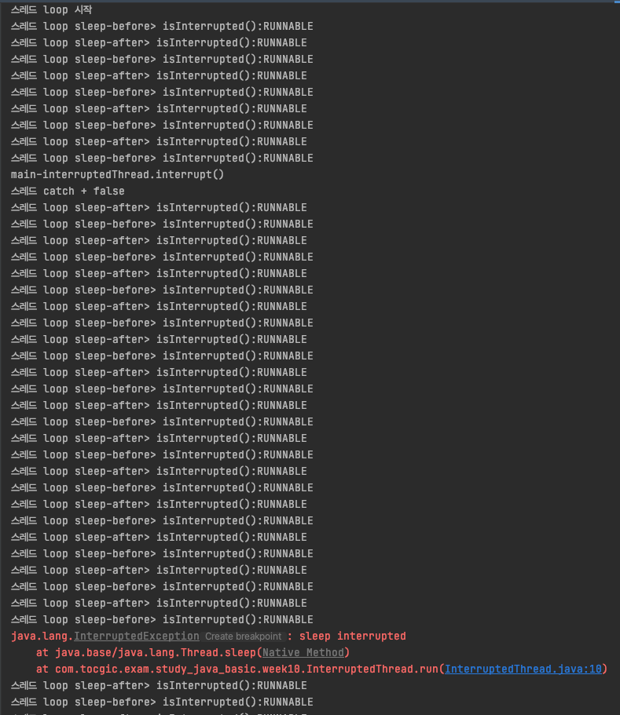
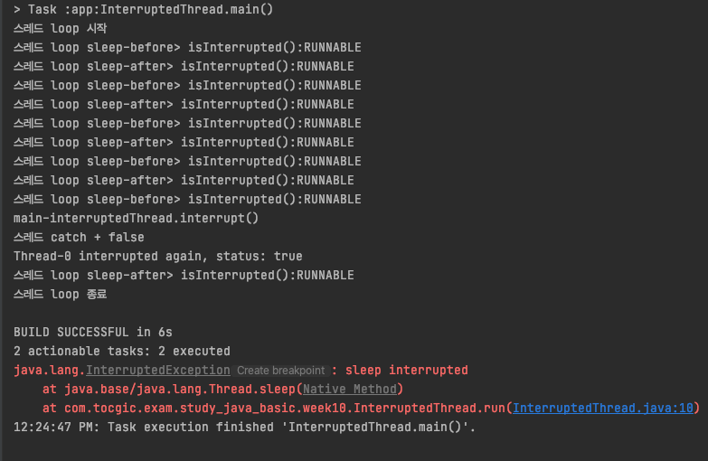
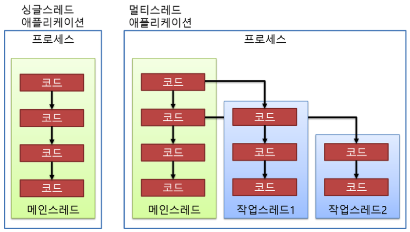

# 10주차 과제: 멀티쓰레드 프로그래밍

> # 목표
>
> 자바의 멀티쓰레드 프로그래밍에 대해 학습하세요.
>
> # 학습할 것 (필수)
>
> - Thread 클래스와 Runnable 인터페이스
> - 쓰레드의 상태
> - 쓰레드의 우선순위
> - Main 쓰레드
> - 동기화
> - 데드락


# 멀티쓰레드 프로그래밍


#### 프로세스(process)

- 실행 중인 프로그램(program)
- 사용자가 작성한 프로그램이 운영체제에 의해 메모리 공간을 할당받아 실행 중인 것
- 프로세스 는 '프로그램에 사용되는 **데이터와 메모리 등의 자원**' 과 '**스레드**' 로 구성됨


#### 스레드(thread)

- 프로세스(process) 내에서 실제로 작업을 수행하는 주체
- 모든 프로세스는 **한 개 이상의 스레드가 존재**하여 작업을 수행
- **두개 이상의 스레드**를 가지는 프로세스를 **멀티스레드 프로세스**(multi-threaded process) 라고 함

- 스레드 우선순위
  - 모든 스레드는 우선 순위가 존제
  - **우선순위가 높은 스레드**가 낮은 스레드보다 **우선적 실행**
  - 각 스레드는 **데몬(deamon)** 으로 **표시**되거나 **표시되지 않을 수도 있음**
  - 일부 스레드에서 실행중인 코드가 **새 Thread객체 를 생성 할 때** 새 스레드는 **처음 생성된 스레드**의 우선 순위와 **동일한 우선 순위**를 자기며, 생성 스레드가 데몬 인 경우에만 데몬 스레드가 됨

- 스레드 종료
  - JVM이 시작될 때, 일반적으로 단일 비 데몬 스레드 (일반적으로 main이 정의된 클래스의 main 메서드 호출)는 다음 중 하나가 발생할때가지 스레드를 계속 실행함
    - `exit`클래스 의 메소드 `Runtime`가 호출되었으며 보안 관리자가 종료 조작이 발생하도록 허용했습니다.
    - 데몬 스레드가 아닌 모든 스레드가 run 메소드 호출에서 반환 하거나 예외 발생하여 종료 됨

- 스레드를 생성 방법
  - Thread 클래스를 상속받아, run 메소드 재정의 함. (확장된 클래스는 인스턴스가 할당되고 실행 될 수 있음)

    ```java
    class PrimeThread extends Thread {
        long minPrime;
        PrimeThread(long minPrime) {
            this.minPrime = minPrime;
        }
      
        public void run() {
            // compute primes larger than minPrime
            . . .
        }
    }
    ```

    실행

    ```java
    PrimeThread p = new PrimeThread(143);
    p.start();
    ```
  - Runnable 인터페이스를 구현하는 클래스 선언 및 run 메소드 구현. (Thread 생성시, 구현한 runnable 인스턴스 전달)
  
    ```java
    class PrimeRun implements Runnable {
        long minPrime;
        PrimeRun(long minPrime) {
            this.minPrime = minPrime;
        }
    
        public void run() {
            // compute primes larger than minPrime
            . . .
        }
    }
    ```
  
    실행
  
    ```java
    PrimeRun p = new PrimeRun(143);
    new Thread(p).start();
    ```

- 스레드 이름

  - 모든 스레드는 식별의 목적으로 이름 이 존제

  - 둘 이상의 스레드가 동일한 이름을 가질 수 있음
  - 스레드 생성시 이름이 지정되지 않는 경우, 새 이름이 생성
  - 생성시, 이름에 대한 인자가 null 인경우, NullPointerException 발생

  

### Thread 클래스와 Runnable 인터페이스

----

> fork, join, full 은 패스, Thread & Runnable 에 있는 메소드, 인터페이스 공부


#### Class Thread

> **Module** java.base
> **Package** java.lang
>
> public class **Thread**
> extends Object
> implements Runnable


###### Static Methods

- **[activeCount](https://docs.oracle.com/en/java/javase/11/docs/api/java.base/java/lang/Thread.html#activeCount())**()

  현재 스레드의 **스레드 그룹** 과 하위 **그룹** 에 있는 활성 스레드 수의 추정치를 반환
  현재 스레드의 스레드 그룹에 있는 모든 하위 그룹을 재귀 반복.
  하위 그룹을 탐색하는 동안 스레드 수가 변동 될 수 있으므로, **추정치 임을 유의**. 디버깅/모니터링 용

- **[currentThread()](https://docs.oracle.com/en/java/javase/11/docs/api/java.base/java/lang/Thread.html#currentThread())**

  현재 실행중인 스레드 인스턴스의 참조 반환(Thread)

- **[dumpStack()](https://docs.oracle.com/en/java/javase/11/docs/api/java.base/java/lang/Thread.html#dumpStack())**

  현재 스레드의 스택 추적을 standard error stream 에 출력. 디버깅 용

- **[enumerate(Thread[] tarray)](https://docs.oracle.com/en/java/javase/11/docs/api/java.base/java/lang/Thread.html#enumerate(java.lang.Thread[]))**

  현재 스레드의 스레드 그룹 및 하위 그룹에있는 모든 활성 스레드를 지정된 배열에 복사
  ThreadGroup.enumerate(Thread[]) 를 호출
  array 보다 스레드가 많은 경우, 추가 스레드는 무시 될 수 있음. activeCount 값과 반환값(배열에 넣은 스레드 수) 과 확인 유의.
  고유한 경쟁 조건(race condition) 으로 디버깅/모니터링 용 권장

  > **race condition** : 멀티 스레드 프로그래밍에서 발생하는 여러 스레드가 다수의 리소스를 경쟁적으로 업데이트 하면 예츨 불가능한 데이터 문제가 발생하는 것을 의미

  - Throws
    SecurityException - ThreadGroup.checkAccess() : 현재 스레드가 해당 스레드 그룹에 액세스 할 수 없다고 판단되는 경우

- **[getAllStackTraces](https://docs.oracle.com/en/java/javase/11/docs/api/java.base/java/lang/Thread.html#getAllStackTraces())**()

  모든 라이브 스레드에 대한 스택 추적 맵 반환.
  메서드가 호출 되는 동안 스레드가 실행될 수 있음. 각 스레드의 스택 추적은 스냅샷 만 나타냄. 추적은 서로 다른 시간에 얻을 수 있음

  - Returns
    Map<Thread, StackTraceElement[]>
  - Throws
    SecurityExcepiton - 보안관리자가 존재하고, checkPermission 메소드가 스레드의 stack trace 를 가져오는 것을 허용하지 않는경우

- **[getDefaultUncaughtExceptionHandler](https://docs.oracle.com/en/java/javase/11/docs/api/java.base/java/lang/Thread.html#getDefaultUncaughtExceptionHandler())**()

  포착되지 않은 예외로 인해 스레드가 갑자기 종료 될 대 호출되는 기본 핸드러를 반환.
  기본값이 없는 경우, null 반환

- **[holdsLock](https://docs.oracle.com/en/java/javase/11/docs/api/java.base/java/lang/Thread.html#holdsLock(java.lang.Object))**([Object](https://docs.oracle.com/en/java/javase/11/docs/api/java.base/java/lang/Object.html) obj)

  현재 스레드가 지정된 개체에 대한 모니터 잠금을 보유하는 경우에만 `true` 반환

- **[interrupted](https://docs.oracle.com/en/java/javase/11/docs/api/java.base/java/lang/Thread.html#interrupted())**()

  현재 스레드가 중단되었는지 여부를 테스트

  > 스레드 의 *중단 된 상태* 는이 메서드에 의해 지워집니다.
  > 즉, 이 메서드가 연속으로 두 번 호출되는 경우 두 번째 호출은 false를 반환합니다
  > (현재 스레드가 다시 중단되지 않는 한 첫 번째 호출이 중단 된 상태를 지운 후 두 번째 호출이이를 검사하기 전에)

- **[onSpinWait](https://docs.oracle.com/en/java/javase/11/docs/api/java.base/java/lang/Thread.html#onSpinWait())**()

  다른 활동에서 하나 이상의 조치가 발생할 때까지 호출자가 일시적으로 진행할 수 없음

  > 예를 들어 일부 플래그가 해당 메서드 외부에 설정 될 때까지 루프에서 회전하는 클래스의 메서드를 고려
  >  `onSpinWait` 메서드에 대한 호출 은 스핀 루프 내부에 있어야합니다

  ```java
  class EventHandler {
      volatile boolean eventNotificationNotReceived;
      void waitForEventAndHandleIt() {
          while (eventNotificationNotReceived) {
              java.lang.Thread.onSpinWait();
          }
          readAndProcessEvent();
      }
  
      void readAndProcessEvent() {
          // Read event from some source and process it
          . . .
      }
  }
  ```

  > 위의 코드는 `onSpinWait` 메서드가 전혀 호출되지 않은 경우에도 올바르게 유지 됨

- **[setDefaultUncaughtExceptionHandler](https://docs.oracle.com/en/java/javase/11/docs/api/java.base/java/lang/Thread.html#setDefaultUncaughtExceptionHandler(java.lang.Thread.UncaughtExceptionHandler))**([Thread.UncaughtExceptionHandler](https://docs.oracle.com/en/java/javase/11/docs/api/java.base/java/lang/Thread.UncaughtExceptionHandler.html) eh)

  잡히지 않은 예외로 인해 스레드가 갑자기 종료되고 해당 스레드에 대해 정의 된 다른 핸들러가 없을 때 호출되는 기본 핸들러를 설정

- **[sleep](https://docs.oracle.com/en/java/javase/11/docs/api/java.base/java/lang/Thread.html#sleep(long))**(long millis)

  시스템 타이머 및 스케줄러의 정밀도와 정확성에 따라 현재 실행중인 스레드가 지정된 밀리 초 동안 잠자기 (일시적으로 실행 중지)

- **[sleep](https://docs.oracle.com/en/java/javase/11/docs/api/java.base/java/lang/Thread.html#sleep(long,int))**(long millis, int nanos)

  시스템 타이머 및 스케줄러의 정밀도와 정확성에 따라 현재 실행중인 스레드가 지정된 밀리 초 수와 지정된 나노초 수 동안 휴면 (일시적으로 실행 중지)

- **[yield](https://docs.oracle.com/en/java/javase/11/docs/api/java.base/java/lang/Thread.html#yield())**()

  현재 스레드가 프로세서의 현재 사용을 양보 할 의사가 있다는 스케줄러에 대한 힌트

  > Yield는 CPU를 과도하게 사용하는 스레드 간의 상대적 진행을 개선하려는 경험적 시도임
  > 실제로 원하는 효과가 있는지 확인하기 위해 자세한 프로파일 링 및 벤치마킹과 함께 사용되어야함
  > 이 방법을 사용하는 것은 거의 적절하지 않음
  > 경쟁 조건으로 인해 버그를 재현하는 데 도움이 될 수있는 디버깅 또는 테스트 목적에 유용


###### Instance Methods

- **[checkAccess](https://docs.oracle.com/en/java/javase/11/docs/api/java.base/java/lang/Thread.html#checkAccess())**()

  현재 실행중인 스레드에이 스레드를 수정할 수있는 권한이 있는지 확인

- **[clone](https://docs.oracle.com/en/java/javase/11/docs/api/java.base/java/lang/Thread.html#clone())**()

  스레드를 의미있게 복제 할 수 없기 때문에 **CloneNotSupportedException** 이 발생

- **[countStackFrames](https://docs.oracle.com/en/java/javase/11/docs/api/java.base/java/lang/Thread.html#countStackFrames())**() - **Deprecated, for removal**

  이 스레드의 스택 프레임 수를 계산합니다. 스레드는 일시 중단되어야함

- **[getContextClassLoader](https://docs.oracle.com/en/java/javase/11/docs/api/java.base/java/lang/Thread.html#getContextClassLoader())**()

  `ClassLoader`이 스레드 의 컨텍스트 를 리턴

- **[getId](https://docs.oracle.com/en/java/javase/11/docs/api/java.base/java/lang/Thread.html#getId())**()

  이 Thread의 식별자를 리턴

- **[getName](https://docs.oracle.com/en/java/javase/11/docs/api/java.base/java/lang/Thread.html#getName())**()

  이 스레드의 이름을 반환

- **[getPriority](https://docs.oracle.com/en/java/javase/11/docs/api/java.base/java/lang/Thread.html#getPriority())**()

  이 스레드의 우선 순위를 반환

- **[getStackTrace](https://docs.oracle.com/en/java/javase/11/docs/api/java.base/java/lang/Thread.html#getStackTrace())**()

  이 스레드의 스택 덤프를 나타내는 스택 추적 요소의 배열을 리턴

- **[getState](https://docs.oracle.com/en/java/javase/11/docs/api/java.base/java/lang/Thread.html#getState())**()

  이 스레드의 상태를 리턴

- **[getThreadGroup](https://docs.oracle.com/en/java/javase/11/docs/api/java.base/java/lang/Thread.html#getThreadGroup())**()

  이 스레드가 속한 스레드 그룹을 반환

- **[getUncaughtExceptionHandler](https://docs.oracle.com/en/java/javase/11/docs/api/java.base/java/lang/Thread.html#getUncaughtExceptionHandler())**()

  이 스레드가 포착되지 않은 예외로 인해 갑자기 종료 될 때 호출되는 핸들러를 리턴

- **[interrupt](https://docs.oracle.com/en/java/javase/11/docs/api/java.base/java/lang/Thread.html#interrupt())**()

  이 스레드를 중단

  > https://coding-factory.tistory.com/571
  > interrupt() 메소드는 스레드가 **일시 정지 상태**에 있을 때 InterruptedException 예외를 발생시키는 역할
  > interrupt() 메소드를 이용하기 위해서는 종료시키고 싶은 메소드가 일시 정지 상태일 때 정지가 가능
  >
  > 스레드가 실행 대기 또는 실행 상태에 있을 때 interrupt() 메소드가 실행되면 즉시 InterruptedException 예외가 발생하지 않고, 스레드가 미래에 일시 정지 상태가 되면 InterruptedException 예외가 발생
  >
  > 스레드가 일시 정지 상태가 되지 않으면 interrupt() 메소드 호출은 아무런 의미가 없음

- **[isAlive](https://docs.oracle.com/en/java/javase/11/docs/api/java.base/java/lang/Thread.html#isAlive())**()

  이 스레드가 살아 있는지 테스트

- **[isDaemon](https://docs.oracle.com/en/java/javase/11/docs/api/java.base/java/lang/Thread.html#isDaemon())**()

  이 스레드가 데몬 스레드인지 테스트

- **[isInterrupted](https://docs.oracle.com/en/java/javase/11/docs/api/java.base/java/lang/Thread.html#isInterrupted())**()

  이 스레드가 중단되었는지 여부를 테스트

  ##### isInterrupted() 가 대부분 false 를 반환 하는 이유

  > https://www.programmersought.com/article/31226505542/
  > Java 스레드를 중단하려면 스레드 클래스 (Thread) 개체의 interrupt() 인스턴스 메서드를 호출 할 수 있습니다.
  > 그러나 interrupt() 메서드는 인터럽트 작업을 즉시 수행하지 않습니다.
  >
  > 특히이 메서드는 스레드에 대해 인터럽트 플래그를 true로 설정 만하고 (인터럽트 플래그는 단지 boolean 변수 임) 설정 후 스레드의 현재 상태에 따라 다른 후속 작업을 수행합니다.
  >
  > 스레드의 현재 상태가 비 차단 상태이면 스레드의 인터럽트 플래그 만 true로 수정됩니다.
  >
  > 스레드의 현재 상태가 차단 된 상태이면 인터럽트 플래그가 true로 설정된 후 **대기, 수면 및 jion의 세 가지 방법에 의해 발생하면 스레드의 인터럽트 플래그가 false로 재설정됩니다. InterruptedException이 발생** 합니다.

  ```java
  public class InterruptedThread extends Thread {
      @Override
      public void run() {
          System.out.println("스레드 loop 시작");
          while (!isInterrupted()) {
              System.out.println("스레드 loop sleep-before> isInterrupted():" + getState().name());
              try {
                  Thread.sleep(100L);
              } catch (InterruptedException e) {
                  e.printStackTrace();
                  System.out.println("스레드 catch + " + isInterrupted());
  //                interrupt();
  //                System.out.println(getName()+" interrupted again, status: "+isInterrupted());
              }
              System.out.println("스레드 loop sleep-after> isInterrupted():" + getState().name());
          }
          System.out.println("스레드 loop 종료");
      }
  
      public static void main(String[] args) {
          InterruptedThread interruptedThread = new InterruptedThread();
          interruptedThread.start();
          try {
              Thread.sleep(500);
          } catch(InterruptedException e) {
              e.printStackTrace();
          }
          System.out.println("main-interruptedThread.interrupt()");
          interruptedThread.interrupt();
      }
  }
  ```

  >
  > 
  >
  >
  > 주석된 부분의 **주석을 풀어주면, isInterrupted() 가 기대한 동작을 수행**한다.
  >
  > ```java
  > interrupt();
  > System.out.println(getName()+" interrupted again, status: "+isInterrupted());
  > ```
  >
  >
  > 

- **[join](https://docs.oracle.com/en/java/javase/11/docs/api/java.base/java/lang/Thread.html#join())**()

  이 스레드가 죽을 때까지 기다림

- **[join](https://docs.oracle.com/en/java/javase/11/docs/api/java.base/java/lang/Thread.html#join(long))**(long millis)

  `millis`이 스레드가 죽을 때까지 최대 밀리 초를 기다림

- **[join](https://docs.oracle.com/en/java/javase/11/docs/api/java.base/java/lang/Thread.html#join(long,int))**(long millis, int nanos)

  이 스레드가 죽을 때까지 최대 `millis`밀리 초와 `nanos`나노초를 기다림

- **[resume](https://docs.oracle.com/en/java/javase/11/docs/api/java.base/java/lang/Thread.html#resume())**() - **Deprecated**

  일시 중단 된 스레드를 다시 시작

- **[run](https://docs.oracle.com/en/java/javase/11/docs/api/java.base/java/lang/Thread.html#run())**()

  이 스레드가 별도의 `Runnable`실행 개체를 사용하여 생성 된 경우 해당 `Runnable`개체의 `run`메서드가 호출됩니다. 그렇지 않으면이 메서드는 아무 작업도 수행하지 않고 반환

- **[setContextClassLoader](https://docs.oracle.com/en/java/javase/11/docs/api/java.base/java/lang/Thread.html#setContextClassLoader(java.lang.ClassLoader))**([ClassLoader](https://docs.oracle.com/en/java/javase/11/docs/api/java.base/java/lang/ClassLoader.html) cl)

  이 Thread에 대한 컨텍스트 ClassLoader를 설정

- **[setDaemon](https://docs.oracle.com/en/java/javase/11/docs/api/java.base/java/lang/Thread.html#setDaemon(boolean))**(boolean on)

  이 스레드를 [데몬](https://docs.oracle.com/en/java/javase/11/docs/api/java.base/java/lang/Thread.html#isDaemon()) 스레드 또는 사용자 스레드로 표시

- **[setName](https://docs.oracle.com/en/java/javase/11/docs/api/java.base/java/lang/Thread.html#setName(java.lang.String))**([String](https://docs.oracle.com/en/java/javase/11/docs/api/java.base/java/lang/String.html) name)

  이 스레드의 이름을 인수와 동일하게 변경

- **[setPriority](https://docs.oracle.com/en/java/javase/11/docs/api/java.base/java/lang/Thread.html#setPriority(int))**(int newPriority)

  이 스레드의 우선 순위를 변경

- **[setUncaughtExceptionHandler](https://docs.oracle.com/en/java/javase/11/docs/api/java.base/java/lang/Thread.html#setUncaughtExceptionHandler(java.lang.Thread.UncaughtExceptionHandler))**([Thread.UncaughtExceptionHandler](https://docs.oracle.com/en/java/javase/11/docs/api/java.base/java/lang/Thread.UncaughtExceptionHandler.html) eh)

  이 스레드가 포착되지 않은 예외로 인해 갑자기 종료 될 때 호출되는 핸들러를 설정

- **[start](https://docs.oracle.com/en/java/javase/11/docs/api/java.base/java/lang/Thread.html#start())**()

  이 스레드가 실행을 시작하도록합니다. Java Virtual Machine `run`은 이 스레드 의 메소드를 호출

- **[stop](https://docs.oracle.com/en/java/javase/11/docs/api/java.base/java/lang/Thread.html#stop())**() - **Deprecated.**

  > 이 방법은 본질적으로 안전하지 않음
  > Thread.stop을 사용하여 스레드를 중지하면 잠긴 모든 모니터의 잠금이 해제됩니다 ( `ThreadDeath`스택 위로 전파 되는 검사되지 않은 예외 의 자연스러운 결과 ). 이러한 모니터에 의해 이전에 보호 된 개체가 일관성없는 상태에있는 경우 손상된 개체가 다른 스레드에 표시되어 잠재적으로 임의의 동작이 발생할 수 있습니다. 많은 용도`stop`대상 스레드가 실행을 중지해야 함을 나타 내기 위해 일부 변수를 수정하는 코드로 대체되어야합니다. 대상 스레드는이 변수를 정기적으로 확인하고 변수가 실행 중지를 나타내는 경우 순서대로 실행 메서드에서 반환해야합니다. 대상 스레드가 오랜 기간 동안 (예 : 조건 변수에서) `interrupt`대기하는 경우이 메서드를 사용하여 대기를 중단해야합니다. 
  > 자세한 내용은 [Thread.stop, Thread.suspend 및 Thread.resume](https://docs.oracle.com/en/java/javase/11/docs/api/java.base/java/lang/doc-files/threadPrimitiveDeprecation.html) 이 더 이상 [사용되지 않는 이유](https://docs.oracle.com/en/java/javase/11/docs/api/java.base/java/lang/doc-files/threadPrimitiveDeprecation.html) 를 참조

  스레드 실행을 강제로 중지

- **[suspend](https://docs.oracle.com/en/java/javase/11/docs/api/java.base/java/lang/Thread.html#suspend())**() - **Deprecated.**

  > 이 방법은 본질적으로 교착 상태가 발생하기 쉬우므로 더 이상 사용되지 않음
  > 대상 스레드가 일시 중단 될 때 중요한 시스템 자원을 보호하는 모니터에 잠금을 보유하면 대상 스레드가 재개 될 때까지 스레드가이 자원에 액세스 할 수 없습니다. 대상 스레드를 재개 할 스레드가를 호출하기 전에이 모니터를 잠그려고하면 `resume`교착 상태가 발생합니다. 이러한 교착 상태는 일반적으로 "고정 된"프로세스로 나타납니다. 
  > 자세한 내용은 [Thread.stop, Thread.suspend 및 Thread.resume](https://docs.oracle.com/en/java/javase/11/docs/api/java.base/java/lang/doc-files/threadPrimitiveDeprecation.html) 이 더 이상 [사용되지 않는 이유](https://docs.oracle.com/en/java/javase/11/docs/api/java.base/java/lang/doc-files/threadPrimitiveDeprecation.html) 를 참조

  이 스레드를 일시 중단

- **[toString](https://docs.oracle.com/en/java/javase/11/docs/api/java.base/java/lang/Thread.html#toString())**()

  스레드의 이름, 우선 순위 및 스레드 그룹을 포함하여이 스레드의 문자열 표현을 반환


#### Interface Runnable

> **Module** java.base
> **Package** java.lang
>
> *@FunctionalInterface*
> public interface Runnable

###### Instance Methods

- **[run](https://docs.oracle.com/en/java/javase/11/docs/api/java.base/java/lang/Runnable.html#run())**()

  객체 구현 인터페이스 `Runnable`가 스레드를 생성하는 데 사용되는 경우 스레드를 시작하면 `run`개별적으로 실행되는 스레드에서 객체의 메서드가 호출됨


### 쓰레드의 상태

----

> 어떤 상태가 있는가?


#### Enum Thread.State

> **Module** java.base
> **Package** java.lang
>
> public static enum Thread.State extends Enum<Thread.State>

- NEW
  아직 시작되지 않은 스레드는이 상태
- RUNNABLE
  Java 가상 머신에서 실행중인 스레드는이 상태
- BLOCKED
  모니터 잠금을 기다리면서 차단 된 스레드는이 상태
- WAITING
  다른 스레드가 특정 작업을 수행 할 때까지 무기한 대기중인 스레드는이 상태
- TIMED_WAITING
  다른 스레드가 지정된 대기 시간까지 작업을 수행하기를 기다리는 스레드는이 상태
- TERMINATED
  종료 된 스레드는이 상태


### 쓰레드의 우선순위

----

> 우선순위 개념?

자바에서 각 스레드는 우선순위(priority)에 관한 자신만의 필드를 가지고 있음
이러한 우선순위에 따라 특정 스레드가 더 많은 시간 동안 작업을 할 수 있도록 설정할 수 있음


```java
/**
 * The minimum priority that a thread can have.
 */
public static final int MIN_PRIORITY = 1;

/**
 * The default priority that is assigned to a thread.
 */
public static final int NORM_PRIORITY = 5;

/**
 * The maximum priority that a thread can have.
 */
public static final int MAX_PRIORITY = 10;
```

- getPriority() / setPriority() 를 통해 값을 확인 하거나 변경 할 수 있음
- 1~10 의 수로, 높을 수록 우선순위가 높음
- 우선순위는, **상대적** 인 값
- 해당 스레드를 생성한 스레드의 **우선순위를 상속** 받음


### Main 쓰레드

----

> 무슨말인지 이해

> **동시성에 대한 Java의 지원**
> 스레드의 개념은 프로세스보다 작지만 여전히 임의의 Java 코드를 실행할 수있는 경량 실행 단위
> 이것이 구현되는 일반적인 방법은 각 스레드가 운영 체제에 대한 완전한 실행 단위가되지만 해당 프로세스를 구성하는 모든 스레드간에 프로세스의 주소 공간이 공유되는 프로세스에 속하는 것.
> 즉, 각 스레드는 독립적으로 예약 될 수 있으며 자체 스택 및 프로그램 카운터가 있지만 동일한 프로세스의 다른 스레드와 메모리 및 개체를 공유함
>
> Java 플랫폼은 첫 번째 버전부터 다중 스레드 프로그래밍을 지원했습니다.
> 플랫폼은 개발자에게 새로운 실행 스레드를 생성하는 기능을 제공합니다.
> 이를 이해하려면 먼저 Java 프로그램이 시작되고 원래 애플리케이션 스레드 (일반적으로 주 스레드라고 함)가 나타날 때 어떤 일이 발생하는지 자세히 고려해야합니다.

Java 가 실행 될때, JVM 상에서 실행이 되며 이것이 하나의 프로세스이다.

JVM 은 프로세스 작업을 수행하기 위해, 자원과 스레드를 할당하여, 약속된 메소드 - main() 를 수행함.

```java
public static void main(String[] args) {
}
```


>
> 
>
> https://gosmcom.tistory.com/19


### 동기화

----

> 어떻게 하는지? 어떻게 처리 하는지?, 쓸때, Lock 으로 쓴는 Object 를 쓰는데 Lock 의 개념

멀티 스레드 에서 한 개의 리소스를 사용하려고 하는 경우, 동시에 접근하는 것을 막는 것 : **Thread-safe**


###### synchronized

- java 의 예약어

- 메소드에 사용

  ```java
  public class SynchronizedTest {
      private int value;
  
      public synchronized void increase() {
          this.value++;
      }
  }
  ```

- block 을 이용하여 코드를 감싸서 사용

  - this 를 사용하는 경우

    ```java
    public class SynchronizedTest {
        private int value;
    
        public void decrease() {
            synchronized (this) {
                this.value--;
            }
        }
    }
    ```

    > synchronized 의 () 에 this 를 사용하는 것은, 메소드에 synchronized 를 사용하는 것 과 같은 효과
  
  - Object 를 사용하는 경우
  
    ```java
    public class SynchronizedTest {
        private int value;
    
        public void increase(@Nonnull Object lockInstance) {
            synchronized (lockInstance) {
                this.value++;
            }
        }
    
        public void decrease(@Nonnull Object lockInstance) {
            synchronized (lockInstance) {
                this.value--;
            }
        }
    
        public void calc(boolean increase, @Nonnull Object lockInstance) {
            for (int i = 0; i < 1000; i++) {
                if (increase) increase(lockInstance);
                else decrease(lockInstance);
            }
        }
    
        public int getValue() {
            return value;
        }
    
        public static class Task extends Thread {
            SynchronizedTest synchronizedTest;
            Object lockInstance;
            boolean isIncrease;
            public Task(SynchronizedTest synchronizedTest, Object lockInstance, boolean isIncrease) {
                this.synchronizedTest = synchronizedTest;
                this.lockInstance = lockInstance;
                this.isIncrease = isIncrease;
            }
    
            @Override
            public void run() {
                synchronizedTest.calc(isIncrease, lockInstance);
            }
        }
    
        public static void main(String[] args) {
            SynchronizedTest synchronizedTest = new SynchronizedTest();
            Task race1 = new Task(synchronizedTest, "LOCK", true);
            Task race2 = new Task(synchronizedTest, "LOCK", false);
            race1.start();
            race2.start();
            try {
                race1.join();
                race2.join();
            } catch (InterruptedException e) {
                e.printStackTrace();
            } finally {
                System.out.println(synchronizedTest.getValue());
            }
        }
    }
    ```
  
    > Task 클래스의 생성자에저 정의 하는 Object 에 따라 동기화 처리를 하도록 함
  


###### volatile

애플리케이션 코드에서 사용하기 전에 필드 또는 변수의 값을 주 메모리에서 다시 읽어야 함을 나타냄
휘발성 값이 수정 된 후 변수에 대한 쓰기가 완료 되 자마자 주 메모리에 다시 기록되어야함

volatile 키워드의 일반적인 사용법

- run-until-shutdown

  외부 사용자 나 시스템이 처리중인 스레드에 현재 작업중인 작업을 완료하고 정상적으로 종료해야한다는 신호를 보내야하는 다중 스레드 프로그래밍에서 사용

  ```java
  private volatile boolean shutdown = false;
  
  public void shutdown() {
      shutdown = true;
  }
  
  public void run() {
      while (!shutdown) {
          // ... process another task
      }
  }
  ```

  > shutdown () 메서드가 다른 스레드에 의해 호출되지 않을 때마다 처리 스레드는 계속해서 작업을 순차적으로 처리
  > (이것은 작업을 전달하기 위해 BlockingQueue와 매우 유용하게 결합되는 경우가 많음)
  >
  > 다른 스레드에서 shutdown ()을 호출하면 처리 스레드는 즉시 종료 플래그가 true로 변경
  > 이것은 실행중인 작업에 영향을주지 않지만 작업이 완료되면 처리 스레드가 다른 작업을 수락하지 않고 대신 정상적으로 종료
  >
  > **그러나 volatile 키워드가 유용하다는 것은 상태의 완전한 보호를 제공하지 않음**
  >
  > Counter의 필드를 volatile로 표시하는 데 사용하면 알 수 있음
  > 이것이 Counter의 코드를 보호 할 것이라고 순진하게 가정 할 수 있음
  > 안타깝게도 관찰 된 이상 값 (및 따라서 손실 된 업데이트 문제의 존재)은 이것이 사실이 아님을 나타냄


### 데드락(Deadlock)

----

> Deadlock 개념? 어떤상황에 발생하는지

교착 상태는 둘 이상의 스레드가 서로를 기다리면서 영원히 차단되는 상황

```java
public class Deadlock {
    static class Friend {
        private final String name;
        public Friend(String name) {
            this.name = name;
        }
        public String getName() {
            return this.name;
        }
        public synchronized void bow(Friend bower) {
            System.out.format("%s: %s"
                + "  has bowed to me!%n", 
                this.name, bower.getName());
            bower.bowBack(this);
        }
        public synchronized void bowBack(Friend bower) {
            System.out.format("%s: %s"
                + " has bowed back to me!%n",
                this.name, bower.getName());
        }
    }

    public static void main(String[] args) {
        final Friend alphonse =
            new Friend("Alphonse");
        final Friend gaston =
            new Friend("Gaston");
        new Thread(new Runnable() {
            public void run() { alphonse.bow(gaston); }
        }).start();
        new Thread(new Runnable() {
            public void run() { gaston.bow(alphonse); }
        }).start();
    }
}
```

> Deadlock이 실행되면 `bowBack` 을 호출하려고 할 때 두 스레드가 모두 차단 될 가능성이 매우 높습니다.
> 각 스레드는 다른 스레드가 `bow` 를 종료하기를 기다리고 있기 때문에 어느 블록도 끝나지 않습니다.


> 참고
>
> http://www.tcpschool.com/java/java_thread_concept
> https://docs.oracle.com/en/java/javase/11/docs/api/java.base/java/lang/Thread.html
> https://docs.oracle.com/en/java/javase/11/docs/api/java.base/java/lang/Runnable.html
> https://docs.oracle.com/en/java/javase/11/docs/api/java.base/java/lang/Thread.State.html
> https://docs.oracle.com/javase/tutorial/essential/concurrency/deadlock.html
>
> Java in a Nutshell, 7th Edition
>
> 
