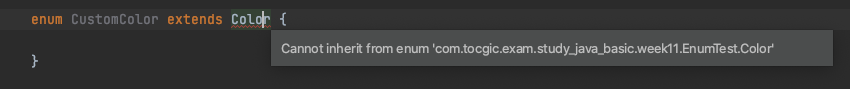
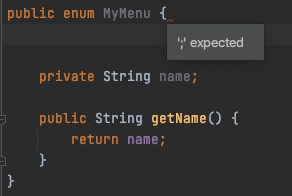
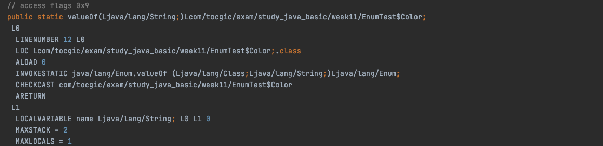
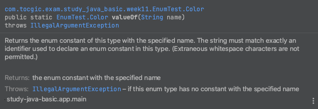
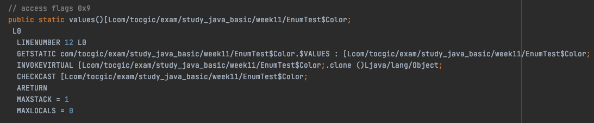
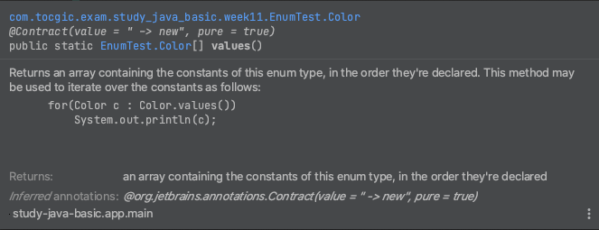
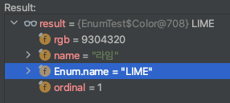
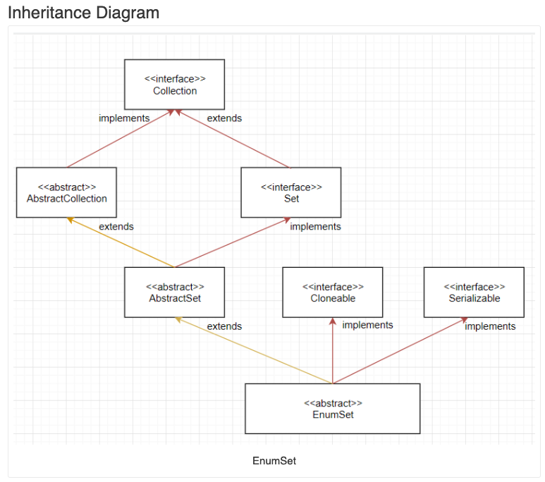

# 11주차 과제: Enum

> # 목표
>
> 자바의 열거형에 대해 학습하세요.
>
> # 학습할 것 (필수)
>
> - enum 정의하는 방법
> - enum이 제공하는 메소드 (values()와 valueOf())
> - java.lang.Enum
> - EnumSet


# Enum

열거 형은 기능이 제한되고 형식에서 허용하는 가능한 값이 제한적인 클래스의 변형.

JDK 1.5 부터 Enum 클래스 사용 가능


###### EnumDeclaration

> {[ClassModifier](https://docs.oracle.com/javase/specs/jls/se11/html/jls-8.html#jls-ClassModifier)} enum [TypeIdentifier](https://docs.oracle.com/javase/specs/jls/se11/html/jls-3.html#jls-TypeIdentifier) [[Superinterfaces](https://docs.oracle.com/javase/specs/jls/se11/html/jls-8.html#jls-Superinterfaces)] [EnumBody](https://docs.oracle.com/javase/specs/jls/se11/html/jls-8.html#jls-EnumBody)

- abstract 이나 final 이 오면 컴파일 타임 오류 발생

- 모두 (암시 적으로) java.lang.Enum 확장

- 인터페이스 구현 가능

- (extends 를 통한) 확장 불가
  

- 모든 열거 형 값이 구현 본문을 제공하는 경우 추상 메서드 만 가질 수 있습니다.

- new에 의해 직접 인스턴스화되지 않을 수 있습니다.


#### enum 정의하는 방법

---

```
EnumDeclaration:
{ClassModifier} enum TypeIdentifier [Superinterfaces] EnumBody

EnumBody:
{ [EnumConstantList] [,] [EnumBodyDeclarations] }

EnumConstantList:
EnumConstant {, EnumConstant}

EnumConstant:
{EnumConstantModifier} Identifier [( [ArgumentList] )] [ClassBody]

EnumConstantModifier:
Annotation
```

> 참조 : https://docs.oracle.com/javase/specs/jls/se11/html/jls-8.html#jls-8.9


###### enum 열거체이름 { 상수1이름, 상수2이름, ...}

```java
enum Color {
    LEMON, LIME, STRAWBERRY // 문단 끝에 `;` 은 필요하지 않음
}
```

> enum 을 사용한 위 코드는 Color 유형의 인스턴스로  `LEMON`, `LIME`, `STRAWBERRY` 유형을 정의하고, 그 유형만 가능함 을 의미 함
>
> Color 유형의 인스턴스는 Color.LEMON, Color.LIME 및 Color.STRAWBERRY 와 같이 정적 필드 인 것처럼 참조
>
> 열거체의 첫 번째 상숫값은 0부터 설정되며, 그 다음은 앞의 상숫값보다 1만큼 증가되며 설정


###### 열거체의 상숫값 정의 및 추가 - enum 의 멤버 필드와 메서드

```java
enum Color {
    LEMON("레몬", 0xfefb00), LIME("라임", 0x8df900), STRAWBERRY("딸기", 0xff2f92); // `;`필요

    private final int rgb;
    private final String name;
    Color(String name, int rgb) {
        this.name = name;
        this.rgb = rgb;
    }
}
```

> 열거 형은 특수한 클래스이므로 열거 형에는 **멤버 필드**와 **메서드** 가 있을 수 있음
>
> 열거 형 인스턴스는 자바 런타임에 의해 생성되고 외부에서 인스턴스화 할 수 없으므로 **생성자는 비공개로 선언**
>
> 열거 형에서 body (멤버 필드나 메소드) 가 있는 경우, <u>인스턴스 목록 끝에 세미콜론이 필요하며, 열거 형 상수 목록이 body 앞에 와야 함</u>
>
> IntelliJ 에서 보면, `MyMenu {` 옆에 오류 표시가 노출됨을 볼 수 있다.
>
>  

#####

###### enum 의 interface 구현

```java
public class EnumTest {
    interface IRGBColor {
        String getName();
        int getRed();
        int getGreen();
        int getBlue();
    }
    enum Color implements IRGBColor {
        LEMON("레몬", 0xfefb00), LIME("라임", 0x8df900), STRAWBERRY("딸기", 0xff2f92);

        private final int rgb;
        private final String name;
        Color(String name, int rgb) {
            this.name = name;
            this.rgb = rgb;
        }

        @Override
        public String getName() {
            return name;
        }

        @Override
        public int getRed() {
            return (rgb & 0x00FF0000) >> 16;
        }

        @Override
        public int getGreen() {
            return (rgb & 0x0000FF00) >> 8;
        }

        @Override
        public int getBlue() {
            return rgb & 0x000000FF;
        }
    }

    public static void main(String[] args) {
        for (IRGBColor color : Color.values()) {
            System.out.printf("%s, Red:%02X, Green:%02X, Blue:%02X%n",
                              color.getName(), color.getRed(), color.getGreen(), color.getBlue());
        }
    }
}
```

> **#OUTPUT**
>
> 레몬, Red:FE, Green:FB, Blue:00
> 라임, Red:8D, Green:F9, Blue:00
> 딸기, Red:FF, Green:2F, Blue:92
>
> BUILD SUCCESSFUL in 298ms


###### enum 상수 (EnumConstant) 에서 classBody 구현

> {EnumConstantModifier} Identifier [( [ArgumentList] )] **[ClassBody]**

```java
protected enum Color implements IRGBColor {
    @Nonnegative LEMON("레몬", 0xfefb00) {
        @Override
        public String getName() {
            return super.getName();
        }

        @Override
        public int getRed() {
            return super.getRed();
        }

        @Override
        public int getGreen() {
            return super.getGreen();
        }

        @Override
        public int getBlue() {
            return super.getBlue();
        }
    }, LIME("라임", 0x8df900), STRAWBERRY("딸기", 0xff2f92);

    private final int rgb;
    private final String name;
    Color(String name, int rgb) {
        this.name = name;
        this.rgb = rgb;
    }


    @Override
    public String getName() {
        return name;
    }

    @Override
    public int getRed() {
        return (rgb & 0x00FF0000) >> 16;
    }

    @Override
    public int getGreen() {
        return (rgb & 0x0000FF00) >> 8;
    }

    @Override
    public int getBlue() {
        return rgb & 0x000000FF;
    }
}
```


#### enum이 제공하는 메소드 (values()와 valueOf())

---


###### valueOf()

지정된 이름을 가진 지정된 열거 형 유형의 열거 형 상수를 반환

> **java.lang.Enum 의 valueOf()**
>
> ```java
> public static <T extends Enum<T>> T valueOf(Class<T> enumType, String name)
> ```
>
>  
>
> **암시적 선언된 메서드**
>
> the implicitly declared public static T valueOf(String) method
>
> ```java
> public static <T extends Enum<T>> T valueOf(String name)
> ```
>
> 
>
>  

- 주어진 이름(인자) 으로 상수가 존재하지 않는 경우, **IllegalArgumentException** 발생
- 주어진 이름(인자) 이 null 인경우, **NullPointerException** 발생


###### values()

values() 메소드는 해당 열거체의 모든 상수를 저장한 배열을 생성하여 반환

> **암시적 선언된 메서드**
>
> 이 메소드는 자바의 모든 열거체에 `컴파일러가 자동으로 추가`해 주는 메소드
>
> 
>
>  


###### 

#### java.lang.Enum

---

Java 언어 열거 유형의 공통 기본 클래스
컴파일러에 의해 합성 된 암시 적으로 선언 된 메서드에 대한 설명을 포함하여 열거 형에 대한 정보
: https://docs.oracle.com/javase/specs/jls/se11/html/jls-8.html#jls-8.9
 집합 유형 또는 맵의 키 유형으로 열거 유형을 사용하는 경우 특수하고 효율적인 집합 및 맵 구현을 사용할 수 있음

열거형은 Enum 클래스를 상속 받기 때문에 확장이 불가능 함


##### Constructors

| Modifier  | Constructor                            | Description        |
| --------- | -------------------------------------- | ------------------ |
| protected | **Enum**(**String** name, int ordinal) | *Sole constructor* |

> Sole constructor
>
> 컴파일러에서 호출되는 생성자. 사용자가 사용할 수 없음


##### Method Summary

###### ordinal()

이 열거 형 상수의 서수 (초기 상수에 0의 서 수가 할당 된 열거 형 선언의 위치)를 반환


###### name()

열거 형 선언에 선언 된대로 정확하게이 열거 형 상수의 이름을 반환

>  
>
> Enum.name 의 값을 반환


###### valueOf()

지정된 이름을 가진 지정된 열거 형 유형의 열거 형 상수를 반환

> 클래스 메소드


#### EnumSet

---

> **Module** java.base
> **Package** java.util

열거 형 유형과 함께 사용하기위한 특수 구현
내부적으로 비트 벡터로 표시 -> 매우 간결하고 효율적
Null 사용 불가 -> null 요소를 삽입하려고하면 NullPointerException
 `EnumSet`동기화되지 않음


 

> https://javatutorial.net/java-enumset-example


###### allOf()

지정된 요소 유형의 모든 요소를 포함하는 열거 형 집합을 생성

```java
EnumSet<Color> colors = EnumSet.allOf(Color.class);
System.out.println(colors); // [LEMON, LIME, STRAWBERRY]
```


###### noneOf()

지정된 요소 유형을 사용하여 빈 열거 형 집합을 생성

```java
EnumSet<Color> emptySets = EnumSet.noneOf(Color.class);
System.out.println("emptySets.size : " + emptySets.size());
```


###### add()

Enum 추가


###### range(Enum1, Enum2 ...)

지정된 두 끝점에 의해 정의 된 범위의 모든 요소를 처음에 포함하는 열거 형 집합을 생성


###### complementOf

처음에는 지정된 집합에 포함 되지 않은 이 형식의 모든 요소를 포함하는 지정된 열거 형 집합과 동일한 요소 형식을 사용하여 열거 형 집합을 생성


> 참고
>
> http://www.tcpschool.com/java/java_api_enum
> https://docs.oracle.com/javase/specs/jls/se11/html/jls-8.html#jls-8.9
> https://docs.oracle.com/en/java/javase/11/docs/api/java.base/java/lang/Enum.html
> https://docs.oracle.com/en/java/javase/11/docs/api/java.base/java/util/EnumSet.html
>
> Java in a Nutshell, 7th Edition
>
