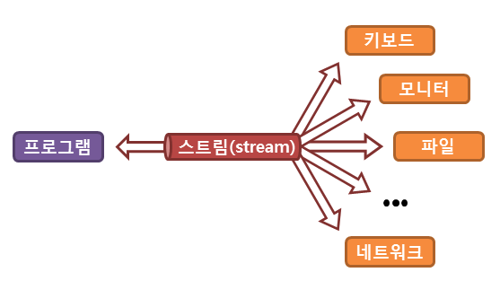
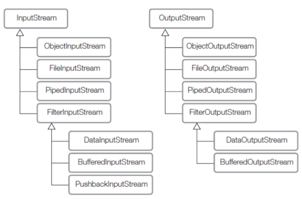
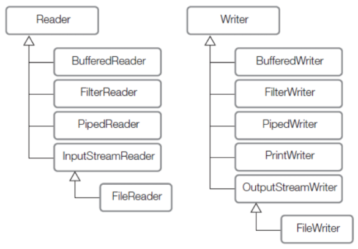

# 12주차 과제: I/O

> # 목표
>
> 자바의 Input과 Ontput에 대해 학습하세요.
>
> # 학습할 것 (필수)
>
> - 스트림 (Stream) / 버퍼 (Buffer) / 채널 (Channel) 기반의 I/O
> - InputStream과 OutputStream
> - Byte와 Character 스트림
> - 표준 스트림 (System.in, System.out, System.err)
> - 파일 읽고 쓰기


### 스트림 (Stream) / 버퍼 (Buffer) / 채널 (Channel) 기반의 I/O

---

#### 스트림 (Stream)

- 스트림(stream)이란 실제의 입력이나 출력이 표현된 데이터의 이상화된 흐름을 의미
  즉, 스트림은 운영체제에 의해 생성되는 가상의 연결 고리를 의미하며, 중간 매개자 역할

 

> 출처 : http://www.tcpschool.com/java/java_io_stream


- FIFO 스트림은 단 방향 통신. 입력과 출력을 동시에 처리할 수는 없음.
  즉, 용도에 따라, 입력 스트림 과 출력 스트림으로 구분됨.

- I / O 스트림 추상화는 디스크 또는 기타 소스의 순차적 바이트 스트림을 처리하는 방법으로 Java 1.0에 존재
  핵심은 한 쌍의 추상 클래스 인 InputStream 및 OutputStream (표준 입/출력인 System.in, System.out 이 해당)


#### 버퍼(Buffer)

- CPU 와 입출력장치의 속도 차이에 의한 저하를 개선하기 위한 개념
- Buffer는 byte, char, int 등 기본 데이터 타입을 저장할 수 있는 저장소로서, 배열과 마찬가지로 제한된 크기(capacity)에 순서대로 데이터를 저장한다.
- Buffer는 데이터를 저장하기 위한 것이지만, 실제로 Buffer가 사용되는 것은 채널을 통해서 데이터를 주고 받을 때이다.
- 채널을 통해서 소켓, 파일 등에 데이터를 전송할 때나 읽어올 때 버퍼를 사용하게 됨으로써 가비지량을 최소화시킬 수 있게 되며, 이는 가비지 콜렉션 회수를 줄임으로써 서버의 전체 처리량(throughput)을 증가시켜준다.
- 즉, 버퍼를 이용해, **호출 횟수(시스템 콜)를 줄여** 효율성을 증대화 시키는 목적이다


#### 채널(Channel)

- 데이터가 통과하는 쌍방향 통로

- 채널에서 데이터를 주고 받을 때 사용되는 것이 버퍼이다.

- 채널에는 소켓과 연결된 SocketChannel, 파일과 연결된 FileChannel, 파이프와 연결된 Pipe.SinkChannel과 Pipe.SourceChannel 등이 존재하며, 서버소켓과 연결된 ServerSocketChannel도 존재한다.

  

### InputStream과 OutputStream

---

| 클래스       | 메소드                                 | 설명                                                         |
| ------------ | -------------------------------------- | ------------------------------------------------------------ |
| InputStream  | abstract int read()                    | 해당 입력 스트림으로부터 다음 바이트를 읽어들임              |
|              | int read(byte[] b)                     | 해당 입력 스트림으로부터 특정 바이트를 읽어들인 후, 배열 b에 저장함 |
|              | int read(byte[] b, int off, int len)   | 해당 입력 스트림으로부터 len 바이트를 읽어들인 후, 배열 b[off]부터 저장함 |
| OutputStream | abstract void write(int b)             | 해당 출력 스트림에 특정 바이트를 저장함                      |
|              | void write(byte[] b)                   | 배열 b의 특정 바이트를 배열 b의 길이만큼 해당 출력 스트림에 저장함 |
|              | void write(byte[] b, int off, int len) | 배열 b[off]부터 len 바이트를 해당 출력 스트림에 저장함       |

#### InputStream

- byte 기반 입력 스트림의 최상위 추상 클래스
- 버퍼, 파일, 네트워크 단에서 입력되는 데이터를 읽어오는 기능 수행

#### OutputStream

- byte 기반 출력 스트림의 최상위 추상 클래스
- 버퍼, 파일, 네트워크 단에서 입력되는 데이터를 내보내는 기능 수행


### Byte와 Character 스트림

---

#### 바이트 스티림(Byte Stream)

- binary 데이터를 입출력하는 스트림.
- 데이터는 1바이트 단위로 처리됨.
- 이미지, 동영상등을 송수신할 때 주도 사용.
- 주요 라이브러리는 *InputStream, *OutputStream 형태의 클래스 이름을 사용.

 

> 참조 : https://dinfree.com/lecture/language/112_java_7.html#m1

#### 문자 스트림(Character Stream)

- text 데이터를 입출력하는 스트림.
- 데이터는 2바이트 단위로 처리됨.
- 일반적인 텍스트 및 JSON, HTML 등을 송수신할 때 주로 사용.
- 주요 라이브러리는 *Reader, *Writer 형태의 클래스 이름을 사용.

 

> 참조 : https://dinfree.com/lecture/language/112_java_7.html#m1


### 표준 스트림 (System.in, System.out, System.err)

---

#### Class System

> **Package** java.lang
>
> public final class **System**
> extends Object


```java
public final class System {
    public static final InputStream in = null;
    public static final PrintStream out = null;
    public static final PrintStream err = null;
    ...
}
```

- PrintStream in 은 키보드의 입력을 받아들이기 위해서 사용하는 입력 스트림
- PrintStream out 은 콘솔 화면에 문자열을 출력하기 위한 용도로 사용되는 스트림
- PrintStream err 도 out 과 같이 콘솔 화면에 문자열을 출력하지만, 차이점이 있음
  - 버퍼링을 지원하지 않음
    : err가 보다 정확하고 빠르게 출력되어야 하기 때문일것이다. 버퍼링은 하던 도중 프로그램이 멈추면 버퍼링된 내용은 출력되지 않기 때문
  - err는 그냥 프로그램이 출력되는 콘솔창에만 출력


### 파일 읽고 쓰기

---

```java
public class FileExam {
    public File getFile(@Nonnull String directory, @Nonnull String fileName) {
        File source = new File(directory, fileName);
        if (!source.exists()) {
            try {
                File parent = source.getParentFile();
                if (!parent.exists()) {
                    parent.mkdirs();
                }
                source.createNewFile();
            } catch (IOException ioException) {
                ioException.printStackTrace();
                System.err.println("source : " + source.getAbsolutePath());
            }
        }
        return source;
    }

    public void writeRead(@Nonnull File source, String... args) {
        try (FileWriter writer = new FileWriter(source)) {
            for (String arg : args) {
                writer.write(arg + "\n");
            }
        } catch (IOException e) {
            e.printStackTrace();
        }
        try (FileReader reader = new FileReader(source)) {
            char ch;
            while ((ch = (char)reader.read()) > Character.MIN_VALUE && ch < Character.MAX_VALUE) {
                System.out.print(ch);
            }
        } catch (IOException e) {
            e.printStackTrace();
        }
    }

    public void writeReadWithBuffer(@Nonnull File source, String... args) {
        try (BufferedWriter writer = new BufferedWriter(new FileWriter(source))) {
            for (String arg : args) {
                writer.write(arg + "\n");
            }
        } catch (IOException e) {
            e.printStackTrace();
        }
        try (BufferedReader reader = new BufferedReader(new FileReader(source))) {
            String line;
            while ((line = reader.readLine()) != null) {
                System.out.println(line);
            }
        } catch (IOException e) {
            e.printStackTrace();
        }
    }
    
    public static void main(String[] args) {
        FileExam fileExam = new FileExam();

        final String directory = "test";
        final String fileName = "test.txt";

        File source = fileExam.getFile(directory, fileName);
        fileExam.writeRead(source, "FileWriter 를 사용하여 파일 쓰기", "FileReader 를 사용하여 파일 읽기");
        fileExam.writeReadWithBuffer(source, "BufferedWriter 를 사용하여 파일 쓰기", "BufferedReader 를 사용하여 파일 읽기");
    }
}
```


> 참고
>
> Java in a Nutshell, 7th Edition
> http://www.tcpschool.com/java/java_io_stream
> https://javacan.tistory.com/entry/73
> https://dinfree.com/lecture/language/112_java_7.html#m1
> https://m.blog.naver.com/PostView.nhn?blogId=force44&logNo=130096406237&proxyReferer=https:%2F%2Fwww.google.com%2F
