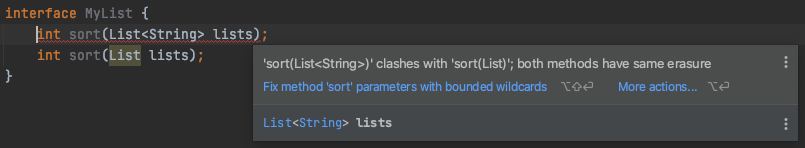

# 14주차 과제: 제네릭

> # 목표
>
> 자바의 Input과 Ontput에 대해 학습하세요.
>
> # 학습할 것 (필수)
>
> - 제네릭 사용법
> - 제네릭 주요 개념 (바운디드 타입, 와일드 카드)
> - 제네릭 메소드 만들기
> - Erasure


### 개요

---

자바의 플렛폼의 큰 장점 중 하나인 표준 라이브러리중 Java Collections 는 공통 데이터 구조의 강력한 구현을 제공함.
하지만, java Collection 의 초기 버전은 상당히 큰 한계가있었음.
이 제한은 데이터 구조 (때때로 컨테이너라고 함)가 본질적으로 저장되는 데이터의 유형을 모호하게 만들었다는 것.

> 데이터 숨김 및 캡슐화는 객체 지향 프로그래밍의 훌륭한 원칙이지만 이 경우 컨테이너의 불투명 한 특성으로 인해 개발자에게 많은 문제가 발생

이 문제를 해결하기 위해 Generic Types 을 도입함 (Java 5)


제네릭은 클래스, 인터페이스 및 메서드를 정의 할 때 **유형** (클래스 및 인터페이스)이 매개 변수가되도록함
메서드 선언에 사용되는 보다 친숙한 **형식 매개 변수** 와 마찬가지로 형식 매개 변수는 다른 입력으로 동일한 코드를 다시 사용할 수있는 방법을 제공.
차이점은 형식 매개 변수에 대한 입력은 값이고 유형 매개 변수에 대한 입력은 유형이라는 것입니다.

- 제네릭 사용의 이점

  - 컴파일 타임에 더 강력한 유형 검사
    Java 컴파일러는 강력한 유형 검사를 일반 코드에 적용하고 코드가 유형 안전성을 위반하는 경우 오류를 발행합니다.
    컴파일 타임 오류를 수정하는 것은 찾기 어려울 수있는 런타임 오류를 수정하는 것보다 쉽습니다.

  - 캐스트 제거
    제네릭이없는 다음 코드 스 니펫은 캐스팅이 필요합니다.

    ```java
    List list = new ArrayList();
    list.add("hello");
    String s = (String) list.get(0);
    ```

    제네릭을 사용하도록 다시 작성하면 코드에 캐스팅이 필요하지 않습니다.

    ```java
    List<String> list = new ArrayList<String>();
    list.add("hello");
    String s = list.get(0);   // no cast
    ```

  - 프로그래머가 일반 알고리즘을 구현할 수 있도록함
    프로그래머는 제네릭을 사용하여 다양한 유형의 컬렉션에서 작동하고 사용자 정의 할 수 있으며 유형이 안전하고 읽기 쉬운 제네릭 알고리즘을 구현할 수 있습니다.

  

### 제네릭 사용법

---

#### Generic Types

유형을 통해 매개 변수화 된 제네릭 클래스 또는 인터페이스입니다. 다음 `Box` 클래스는 개념을 보여주기 위해 수정됩니다.


###### A Simple Box Class

```java
public class Box {
    private Object object;

    public void set(Object object) { this.object = object; }
    public Object get() { return object; }
}
```

> 메서드가 `Object를` 수락하거나 반환 하므로 기본 유형 중 하나가 아니라면 원하는대로 자유롭게 전달할 수 있음
> 컴파일 타임에 클래스가 어떻게 사용되는지 확인할 방법이 없음. 코드의 한 부분은 `Integer` 를 상자에 넣고 `Integer` 를 가져올 것으로 예상하는 반면 코드의 다른 부분은 실수로 `String을` 전달 하여 런타임 오류가 발생할 수 있음.


###### A Generic Version of the Box Class

**제네릭 클래스는** 다음과 같은 형식으로 정의된다 

```java
class name<T1, T2, ..., Tn> { /* ... */ }
```

>  꺾쇠 괄호 ( `<>` )로 구분 된 유형 매개 변수(type parameter) 섹션 은 클래스 이름 뒤에옵니다.
> 그것은 지정 **타입 파라미터** (또한 *입력 변수* ) `T1` , `T2` , ..., 및 `Tn` .

위 Box Class 는 다음 처럼 변경 할 수 있음

```java
/**
 * Generic version of the Box class.
 * @param <T> the type of the value being boxed
 */
public class Box<T> {
    // T stands for "Type"
    private T t;

    public void set(T t) { this.t = t; }
    public T get() { return t; }
}
```

> 보시다시피 `Object의` 모든 발생은 `T` 로 대체됩니다 . 유형 변수는 모든 클래스 유형, 인터페이스 유형, 배열 유형 또는 다른 유형 변수와 같이 사용자가 지정하는 **기본이 아닌** 유형일 수 있습니다 .

이 동일한 기술을 적용하여 일반 인터페이스를 만들 수 있습니다.


###### Type Parameters Naming Conventions

규칙에 따라 유형 매개 변수 이름은 단일 대문자.
이것은 이미 알고 있는 변수 [명명](https://docs.oracle.com/javase/tutorial/java/nutsandbolts/variables.html#naming) 규칙 과 뚜렷한 대조를 이루며 그럴만 한 이유가 있습니다.
이 규칙이 없으면 형식 변수와 일반 클래스 또는 인터페이스 이름의 차이를 구분하기 어려울 것입니다.

- 일반적으로 사용되는 유형 매개 변수 이름

  - E - Element (used extensively by the Java Collections Framework)
  - K - Key
  - N - Number
  - T - Type
  - V - Value
  - S,U,V etc. - 2nd, 3rd, 4th types

  

###### Invoking and Instantiating a Generic Type

코드 내에서 제네릭 `Box` 클래스 를 참조하려면 `T` 를 `Integer` 와 같은 구체적인 값으로 대체 하는 *제네릭 유형 호출을* 수행해야합니다 .

```java
Box <Integer> integerBox;
```

> **Type Parameter and Type Argument Terminology**
>
> 많은 개발자가 **유형 매개 변수(type parameter)** 와 **유형 인수(type argument)** 라는 용어를 같은 의미로 사용하지만 이러한 용어는 동일하지 않습니다. 코딩 할 때 매개 변수화 된 유형을 생성하기 위해 유형 인수를 제공합니다.
>
> - `Foo <T>` 에서 `T` 가 유형 파라미터(type parameter)
> - `Foo<String> F` 에서 `String`  는 형태 인자(type argument)


이 코드는 실제로 새 `Box` 객체를 생성하지 않음
단순히 `integerBox` 가 " `Box` of `Integer` "에 대한 참조를 보유 할 것이라고 선언합니다 . 이는 `Box<Integer>` 를 읽는 방법입니다.

제네릭 유형의 호출을 일반적으로 *매개 변수화 된 유형이라고* 합니다.

이 클래스를 인스턴스화하려면 평소와 같이 `new` 키워드를 사용 하되 클래스 이름과 괄호 사이에 `<Integer>` 를 넣어야 함

```java
Box <Integer> integerBox = new Box <Integer>();
```


###### Diamond Syntax

- Java 7
- 제네릭 유형의 인스턴스를 만들 때 할당 문의 오른쪽은 유형 매개 변수의 값을 반복
- 컴파일러가 유형 매개 변수의 값을 유추 할 수 있으므로 이는 일반적으로 필요하지 않음
- 최신 버전의 Java에서는 다이아몬드 구문이라고하는 반복 유형 값을 생략 할 수 있음

```java
List<String> names = new ArrayList<>();
```

 


###### Multiple Type Parameters

제네릭 클래스는 여러 유형 매개 변수를 가질 수 있음

예를 들어, 일반 `Pair` 인터페이스 를 구현하는 일반 `OrderedPair` 클래스는 다음과 같습니다

```java
public interface Pair<K, V> {
    public K getKey();
    public V getValue();
}

public class OrderedPair<K, V> implements Pair<K, V> {
    private K key;
    private V value;

    public OrderedPair(K key, V value) {
			this.key = key;
			this.value = value;
    }

    public K getKey()	{ return key; }
    public V getValue() { return value; }
}
```

다음 문은 `OrderedPair` 클래스 의 두 인스턴스화를 만듭니다 .

```java
Pair<String, Integer> p1 = new OrderedPair<String, Integer>("Even", 8);
Pair<String, String> p2 = new OrderedPair<String, String>("hello", "world");
```

`new OrderedPair<String, Integer>` 코드는 `K` 를 `String으로` , `V` 를 `Integer` 로 인스턴스화 합니다. 따라서 `OrderedPair` 생성자 의 매개 변수 유형은 각각 `String` 및 `Integer` 입니다. [autoboxing](https://docs.oracle.com/javase/tutorial/java/data/autoboxing.html) 으로 인해 `String` 및 `int` 를 클래스 에 전달하는 것이 유효합니다 .

> *Autoboxing* 은 Java 컴파일러가 기본 유형과 해당 객체 래퍼 클래스간에 수행하는 자동 변환입니다. 예를 들어 `int` 를 `Integer로` , `double` 을 `Double` 로 변환하는 등의 작업이 있습니다. 변환이 다른 방식으로 진행되는 경우이를 *unboxing* 이라고 합니다.


diamond syntax 적용

```java
OrderedPair<String, Integer> p1 = new OrderedPair<>("Even", 8);
OrderedPair<String, String>  p2 = new OrderedPair<>("hello", "world");
```


###### Parameterized Types

유형 매개 변수 (예 : `K` 또는 `V` )를 매개 변수화 된 유형 (예 : `List <String>` )으로 대체 할 수도 있습니다 .

예를 들어 `OrderedPair <K, V>` 예제를 사용하면 다음과 같습니다.

```java
OrderedPair<String, Box<Integer>> p = new OrderedPair<>("primes", new Box<Integer>(...));
```


### 제네릭 주요 개념 (바운디드 타입, 와일드 카드)

---

#### Bounded Type Parameters (경계 유형 매개 변수)

: 유형 매개 변수의 값으로 사용할 수있는 유형을 제한하는 기능


다음과 같이 특정 유형을 담는 Box 클래스가 있을때

```java
public class Box<T> {
    protected T value;
    public void box(T t) {
        value = t;
    }
    public T unbox() {
        T t = value;
        value = null;
        return t;
    }
}
```

숫자 유형만 을 제한 하기 위해 다음 과 같이 사용할 수 있음

```java
public class NumberBox<T extends Number> extends Box<T> {
    public int intValue() {
        return value.intValue();
    }
}
```

T 가 Number 를 상속하는것 으로 인해, T 는 Number 유형만 허용 될 수 있도록 제한이 되기 때문에, value 는 `intValue()` 메소드가 존재함을 보증함

 


> 타입 바운드 회피가 가능하므로, 런타임 예외에 취약 함
>
> ```java
> public static void main(String[] args) {
>     NumberBox n = new NumberBox<>();
>     n.box(new Object());
>     try {
>         System.out.println(n.intValue());
>     } catch (Exception e) {
>         e.printStackTrace();
>     }
> }
> ```
>
> IntelliJ 에서는 경로 표시를 해줌
> 
>
> 실행시, 오류 발생
>
> 


#### Wildcards (와일드 카드)

일반 코드 에서 *와일드 카드* 라고하는 물음표 ( `?` ) 는 알 수없는 유형을 나타냅니다.
와일드 카드는 매개 변수, 필드 또는 지역 변수의 유형으로 다양한 상황에서 사용할 수 있습니다.
때로는 반환 유형으로 사용됩니다 (더 구체적으로 작성하는 것이 더 나은 프로그래밍 방법 임에도 불구하고).
와일드 카드는 제네릭 메서드 호출, 제네릭 클래스 인스턴스 생성 또는 수퍼 타입에 대한 유형 인수로 사용되지 않습니다.


###### Upper Bounded Wildcards

상한 와일드 카드를 사용하여 변수에 대한 제한을 완화 할 수 있습니다.
예를 들어, 메소드에서 사용할 변수가 `List<Integer>` , `List<Double>` ,  `List<Number>` 있다면, 상한 와일드 카드를 사용하여이를 합칠 수 있음.

상한 와일드 카드를 선언하려면 와일드 카드 문자 ( ' `?` '), `extends` 키워드, *상한을* 차례로 사용합니다 . 이 문맥에서 `extends` 는 "extends"(클래스) 또는 "implements"(인터페이스)을 의미하는 일반적인 의미로 사용됩니다.

```java
public static void process(List<? extends Foo> list) { /* ... */ }
```


###### Unbounded Wildcards

제한되지 않은 와일드 카드 유형은 와일드 카드 문자 ( `?` )를 사용하여 지정됩니다 ( 예 : `List <?>)` . 
이를 *알 수없는 유형* 의 *목록* 이라고합니다.
제한되지 않은 와일드 카드가 유용한 접근 방식 인 두 가지 시나리오가 있습니다.

- `Object` 클래스 에서 제공하는 기능을 사용하여 구현할 수있는 메서드를 작성하는 경우 .
- 코드가 형식 매개 변수에 의존하지 않는 제네릭 클래스의 메서드를 사용하는 경우. 예를 들어, `List.size` 또는 `List.clear` 입니다. 사실, `클래스 <?>` 에서 방법의 대부분 때문에 너무 자주 사용되는 `클래스 <T는>` 에 의존하지 않는 `T` .

```java
public static void printList(List <Object> list) {
    for (Object elem : list)
        System.out.println (elem + "");
    System.out.println ();
}
```

```java
public static void printList(List <?> list) {
    for (Object elem : list)
        System.out.print (elem + "");
    System.out.println ();
}
```

```java
List<Integer> li = Arrays.asList(1, 2, 3);
List<String> ls = Arrays.asList( "one", "two", "three");
printList (li);
printList (ls);
```


###### Lower Bounded Wildcards

[상부 경계 와일드 카드의](https://docs.oracle.com/javase/tutorial/java/generics/upperBounded.html) 상부 경계 와일드 미지 유형을 제한하는 프로그램 섹션은 특정 유형 또는 유형의 서브 타입을받으며 사용 표현 `extends` 키워드. 비슷한 방식으로 *하한* 와일드 카드는 알 수없는 유형을 특정 유형 또는 해당 유형의 *수퍼 유형* 으로 제한합니다 .

하한 와일드 카드는 `super` 키워드 다음에 와일드 카드 문자 ( ' `?` ')와 *하한이* 뒤 따르는 와일드 카드 문자 ( ' `?` ')를 사용하여 표현됩니다 . `<? super A>` 

```java
public static void addNumbers(List <? super Integer> list) {
    for (int i = 1; i <= 10; i ++) {
        list.add (i);
    }
}
```


### 제네릭 메소드 만들기

---

*일반 메서드* 는 자체 형식 매개 변수를 도입하는 메서드.
이것은 제네릭 형식을 선언하는 것과 비슷하지만 형식 매개 변수의 범위는 선언 된 메서드로 제한.
제네릭 클래스 생성자뿐만 아니라 정적 및 비 정적 제네릭 메서드가 허용.

제네릭 메서드의 구문에는 메서드의 반환 형식 앞에 나타나는 꺾쇠 괄호 안에 형식 매개 변수 목록이 포함됩니다.
정적 제네릭 메서드의 경우 형식 매개 변수 섹션이 메서드의 반환 형식 앞에 나타나야합니다.

```java
public class Util {
    public static <K, V> boolean compare(Pair<K, V> p1, Pair<K, V> p2) {
        return p1.getKey().equals(p2.getKey()) &&
               p1.getValue().equals(p2.getValue());
    }
}

public class Pair<K, V> {
    private K key;
    private V value;

    public Pair(K key, V value) {
        this.key = key;
        this.value = value;
    }

    public void setKey(K key) { this.key = key; }
    public void setValue(V value) { this.value = value; }
    public K getKey()   { return key; }
    public V getValue() { return value; }
}
```

이 메서드를 호출하는 전체 구문

```java
Pair<Integer, String> p1 = new Pair<>(1, "apple");
Pair<Integer, String> p2 = new Pair<>(2, "pear");
boolean same = Util.<Integer, String>compare(p1, p2);
```

위 코드에서, Util.**<Integer, String>**compare 굵게 표시한 부분은 생략 할 수 있으며, 컴파일러는 필요한 유형을 추론 함

```java
boolean same = Util.compare(p1, p2);
```

> *유형 추론* 이라고하는이 기능을 사용하면 꺾쇠 괄호 사이에 유형을 지정하지 않고도 일반 메서드를 일반 메서드로 호출 할 수 있음


### Erasure (유형 삭제)

---

Java 5에 제네릭을 추가 한 것은 새로운 언어 기능에 대해 이전 버전과의 호환성이 문제가되는 또 다른 예

이전의 비 제네릭 컬렉션 클래스를 새로운 제네릭 컬렉션과 함께 사용할 수있는 형식 시스템을 만들기 위해, 캐스트를 사용하여 해결하도록 모색함

```java
List someThings = getSomeThings();
// 안전하지 않은 캐스트이지만 someThings의 내용은 실제로 문자열이라는 것을 알고있는 경우
List<String> myStrings = (List<String>)someThings;
```

이는 List 및 List \<String>이 적어도 일정 수준에서 유형으로 호환된다는 것을 의미

 **Java는 유형 삭제를 통해이 호환성을 해결함**

즉, 일반 유형 매개 변수는 컴파일시에만 표시되며 javac에 의해 제거되고 바이트 코드에 반영되지 않음

> 비 제네릭 유형 목록은 일반적으로 원시 유형이라고함.
> 원시 형식의 형식으로 작업하는 것은 여전히 완벽하게 합법적 인 Java입니다. 현재 일반 형식 인 경우에도 마찬가지입니다. 그러나 이것은 거의 항상 품질이 좋지 않은 코드의 신호.


유형 삭제 예시

 

정상적인 overloading 같이 보이지만, 실제는 유형 삭제가되어 두 서명이 동일한 형태를 취하게 된다.

```java
int sort(List lists);
```

유형 삭제 후 남은 것은 컨테이너의 원시 유형(raw type) 만 남게 된다.


> 참고
>
> Java in a Nutshell, 7th Edition
> 
> https://docs.oracle.com/javase/tutorial/java/generics/types.html
