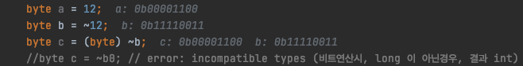
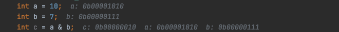
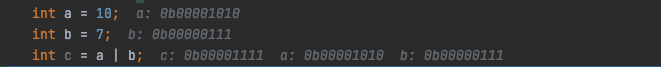
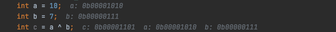
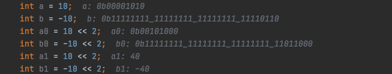
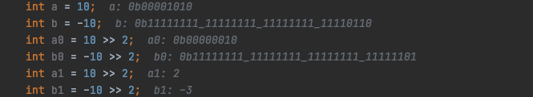
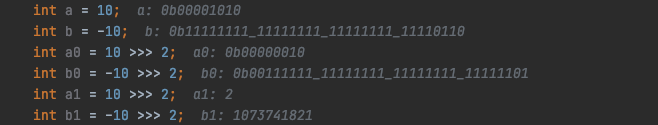
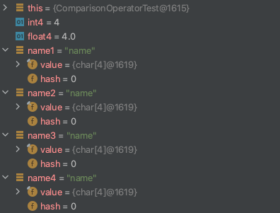

# 3주차 과제: 연산자

> # 목표
>
> 자바가 제공하는 다양한 연산자를 학습하세요.
>
> # 학습할 것
>
> - 산술 연산자
> - 비트 연산자
> - 관계 연산자
> - 논리 연산자
> - instanceof
> - assignment(=) operator
> - 화살표(->) 연산자
> - 3항 연산자
> - 연산자 우선 순위
> - (optional) Java 13. switch 연산자
>
> # 마감일시
>
> 2020년 11월 28일 오후 3시까지.


## 산술 연산자 (Arithmetic Operator)

- 산술 연산자는 정수, 부동 소수점, 문자와 함께 사용할 수 있음. (boolean 이외의 Primitive Type 과 함께 사용할 수 있음)
- 피연산자 중 하나가 부동 소수점 이 있으면, 부동 소수점 산술이 사용됨. (없으면, 정수 산술)
- 정수 산술과 부동 소수점 산술은 나누기가 수행되는 방식과 언더 플로 및 오버플로가 처리되는 방식이 다르기 때문에 중요.


#### Addition `+`

+ \+ 연산자는 두 개의 숫자의 합을 구함.
+ \+ 연산자를 사용하여 문자열을 연결할 수도 있음.
  \+ 의 피연산자 중 **하나가 문자열**이면 **다른 피연산자도 문자열로 변환**. 
  더하기와 연산 후 결합하려면 괄호를 사용해야함.

```java
    public void addition() {
        System.out.println("Total: " + 3 + 4); // "Total: 34"
        System.out.println("Total: " + (3 + 4)); // "Total: 7"
        System.out.println(3 + 4 + " is Total"); // "7 is Total"
        System.out.println(+ 3); // "3"
    }
```

> - 산술 연산 시, 이항 연산자 필요
> - 부호 연산 시, 단항 연산자
> - 연산자 우선순위를 따라, 수행 되므로, 연산하는 피연산자의 자료형에 따라, 바뀔 수 있음


#### Subtraction `-`

- 첫 번째 피연산자에서 두 번째 피연산자를 빼는 연산자.
- 예를 들어, 7-3은 4로 처리.
- 단일 피연산자에서 사용시, \- 연산자는 단항 연산 (unary negation)을 수행 할 수 있음.

```java
    public void subtraction() {
        System.out.println(7 - 3); // 4
        System.out.println(-3); // -3
        System.out.println(- 3); // -3
        System.out.println(-  3); // -3
    }
```


####Multiplication `*`

- \* 연산자는 두 개의 피연산자를 곱하는 연산자.
- 예를 들어 7 * 3은 21로 처리.

```java
    public void multiplication() {
        System.out.println(7 * 3); // 21
        System.out.println(7 * 3L); // 21
        System.out.println(7 * 3.0f); // 21.0
        System.out.println(7 * 3.0d); // 21.0
        //System.out.println(* 3); // compile error
    }
```


#### Division `/`

- / 연산자는 첫 번째 피연산자를 두 번째로 나누는 연산자.
- 두 피연산자가 모두 정수이면 결과는 정수이고 나머지는 모두 버림.
- 피연산자가 부동 소수점 값이면 결과는 부동 소수점 값.
- 두 정수를 나눌 때 0으로 나누면 ArithmeticException이 발생.

```java
    public void division() {
        System.out.println(7 / 3); // 2
        System.out.println(7 / 3L); // 2
        System.out.println(7L / 3); // 2
        System.out.println(7 / 3.0f); // 2.3333333
        System.out.println(7.0f / 3); // 2.3333333
        System.out.println(7.0f / 3.0f); // 2.3333333
        System.out.println(7 / 3.0); // 2.3333333333333335
        System.out.println(7 / 3.0d); // 2.3333333333333335
        System.out.println(-7 / 0.0); // -Infinity
        System.out.println(7 / 0.0); // Infinity
        System.out.println(0.0 / 0.0); // NaN
        System.out.println(Float.NaN); // NaN
        System.out.println(Float.NEGATIVE_INFINITY); // -Infinity
        System.out.println(Float.POSITIVE_INFINITY); // Infinity
        //System.out.println(7 / 0); // throw ArithmeticException
    }
```

> Float.java
>
> ```java
> /**
>      * A constant holding the positive infinity of type
>      * {@code float}. It is equal to the value returned by
>      * {@code Float.intBitsToFloat(0x7f800000)}.
>      */
>     public static final float POSITIVE_INFINITY = 1.0f / 0.0f;
> 
>     /**
>      * A constant holding the negative infinity of type
>      * {@code float}. It is equal to the value returned by
>      * {@code Float.intBitsToFloat(0xff800000)}.
>      */
>     public static final float NEGATIVE_INFINITY = -1.0f / 0.0f;
> 
>     /**
>      * A constant holding a Not-a-Number (NaN) value of type
>      * {@code float}.  It is equivalent to the value returned by
>      * {@code Float.intBitsToFloat(0x7fc00000)}.
>      */
>     public static final float NaN = 0.0f / 0.0f;
> ```


#### Modulo `%`

- % 연산자는 첫 번째 피연산자를 두 번째 피연산자로 모듈로 계산. (즉, 첫 번째 피연산자가 두 번째 피연산자로 나눌 때 나머지를 반환).
- 결과의 부호는 첫 번째 피연산자의 부호와 동일
- 모듈로 연산자는 일반적으로 정수 피연산자와 함께 사용되지만 부동 소수점 값에도 작동.
- 정수로 계산 시, 모듈로 0 값을 계산하려고하면 ArithmeticException이 발생
- 부동 소수점 값으로 계산 시, 0.0 모듈로 모든 항목은 무한 모듈로 모든 항목과 마찬가지로 NaN으로 처리

```java
    public void modulo() {
        System.out.println(7 % 3); // 1
        System.out.println(7 % 3L); // 1
        System.out.println(7 % 2.1f); // 0.7000003
        System.out.println(7 % 2.1d); // 0.6999999999999997
        System.out.println(7.0f % 2.1f); // 0.7000003
        System.out.println(7.0d % 2.1d); // 0.6999999999999997
        System.out.println(4.3f % 2.1f); // 0.10000038
        System.out.println(4.3f % 2.1d); // 0.1000001907348631
        System.out.println(4.3d % 2.1d); // 0.09999999999999964
        System.out.println(4.3d % 2.1f); // 0.1000001907348631
        System.out.println(4.3 % 2.1); // 0.09999999999999964
        System.out.println(-7 % 0.0); // Nan
        System.out.println(7 % 0.0); // Nan
        System.out.println(0.0 % 0.0); // NaN
        //System.out.println(7 % 0); // throw ArithmeticException
    }
```


#### Unary minus `-`

- \- 연산자가 단항 연산자로 사용되면 (즉, 단일 피연산자 앞에) 단항 부정을 수행.
- 즉, 양의 값을 동등한 음의 값으로 변환하고 그 반대의 경우도 마찬가지.

```java
    public void unaryMinus() {
        System.out.println(-2); // -2
        System.out.println(-2L); // -2
        System.out.println(-2.0f); // -2.0
        System.out.println(-2.0d); // -2.0
        System.out.println(-0); // 0
    }
```


## 비트 연산자 (Bitwise Operator)

- 비트 및 시프트 연산자는 정수 값을 구성하는 개별 비트를 조작하는 하위 수준 연산자.

- 비트 연산자는 저수준 작업 (예 : 네트워크 프로그래밍)을 제외하고는 최신 Java에서 일반적으로 사용되지 않음.

- 값에서 개별 플래그 비트를 테스트하고 설정하는 데 사용.

- `이진수` 와 음의 정수를 나타내는 데 사용되는 `2의 보수` 지식 필요.

- 부동 소수점, boolean, 배열 또는 객체 피연산자와 함께 사용할 수 없음.

  - boolean 피연산자와 함께 사용하면 `&, |, ^` 연산자는 `논리 연산자` 로 수행
  - **비트 연산자에 대한 인수 중 하나가 long이면 결과는 long (아닌경우, int)**
  - **시프트 연산자의 왼쪽 피연산자가 long이면 결과는 long (아닌경우, int)**

- 비트연산 진리표

  | 연산자  | 입력1 | 입력2 | 결과 |
  | ------- | ----- | ----- | ---- |
  | `~ (NOT)` | 1     | X     | 0    |
  |         | 0     | X     | 1    |
  | `& (AND)` | 1 | 1 | 1 |
  |         | 1 | 0 | 0 |
  |         | 0 | 1 | 0 |
  |         | 0 | 0 | 0 |
  | `\| (OR)` | 1 | 1 | 1 |
  |         | 1 | 0 | 1 |
  |         | 0 | 1 | 1 |
  |         | 0 | 0 | 0 |
  | `^ (XOR)` | 1 | 1 | 0 |
  |         | 1 | 0 | 1 |
  |         | 0 | 1 | 1 |
  |         | 0 | 0 | 0 |
  
  

#### Bitwise complement `~`

- 단항 ~ 연산자는 `비트 보수` 또는 `비트 NOT` 연산자
- 단일 피연산자의 각 비트를 반전하여 1을 0으로, 0을 1로 변환
  

- 사용 예

  > flags = flags & ~f; *// Clear flag f in a set of flags*

  

#### Bitwise AND `&`

- 개별 비트에 대해 boolean `AND 연산`을 수행하여 두 정수 피연산자를 결합.

- 결과에는 해당 비트가 두 피연산자 모두에 '1' 경우에만 비트가 설정 ('1')
  
  
- 사용 예
  
  > if ((flags & f) != 0) *// Test whether flag f is set*
  
  

#### Bitwise OR `|`

- 개별 비트에 대해 boolean `OR 연산`을 수행하여 두 정수 피연산자를 결합.

- 해당 비트가 피연산자 중 하나 이상 '1' 인 경우, 비트 설정 ('1')

- 두 피연산자 비트가 모두 0 인 경우에만 0.

  

- 사용 예

  > flags = flags | f; *// Set flag f*

  

#### Bitwise XOR `^`

- 개별 비트에 대해 boolean `XOR (배타적 OR) 연산`을 수행하여 두 정수 피연산자를 결합.
- 두 피연산자의 해당 비트가 다른 경우 결과에는 비트 '1'.
- 해당 피연산자 비트가 모두 1 또는 모두 0이면 결과 비트 '0'.
  


#### Left shift `<<`

- << 연산자는 왼쪽 피연산자의 비트를 오른쪽 피연산자로 지정된 자릿수만큼 왼쪽 이동
- 왼쪽 피연산자의 상위 비트는 손실되고 0 비트는 오른쪽에서 이동
- 정수를 n 자리만큼 왼쪽으로 이동하는 것은 해당 숫자에 2n을 곱하는 것과 같음
  


#### Signed right shift `>>`

- \>> 연산자는 왼쪽 피연산자의 비트를 오른쪽 피연산자에 지정된 자리 수만큼 오른쪽으로 이동
- 왼쪽 피연산자의 하위 비트는 멀리 시프트되어 손실됩니다. 시프트 된 상위 비트는 왼쪽 피연산자의 원래 상위 비트와 동일
- 즉, 왼쪽 피연산자가 양수이면 0이 상위 비트로 이동됩니다. 왼쪽 피연산자가 음수이면 1이 대신 이동.
- 부호 확장
- 왼쪽 피연산자의 부호를 유지하는 데 사용.

  


#### Unsigned right shift `>>>`

- \>> 연산자와 비슷하지만 왼쪽 피연산자의 **부호에 관계없이 항상 결과의 상위 비트로** 0을 이동.
-  제로 확장
- 왼쪽 피연산자가 부호없는 값으로 처리 시 적절 (Java 정수 유형이 모두 부호가 있음에도 불구하고).
  


## 관계 연산자 (Comparison Operators)

- 같거나 같지 않은 값을 판단
- 크거나 작은 관계를 판단
- boolean 결과를 도출
  - if 문과 while 및 for 루프와 함께 사용


#### Equals `==`

- Primitive Type 비교시, `동일한 값` 여부 true/false
- Reference Type 비교시, `동일한 객체` 여부 true/flase

```java
        int int4 = 4;
        float float4 = 4f;
        System.out.println(int4 == float4); // true
        String name1 = "name";
        String name2 = "name";
        System.out.println(name1 == name2); // true
        String name3 = new String("name");
        String name4 = new String("name");
        System.out.println(name3 == name4); // false
```

> primitive type 중 타입이 다른 경우, 크기가 큰 피연산자 타입으로 변환
>
> reference type 의 비교 참고
> 


#### Not Equals `!=`

- `==` 연산자의 `!` 결과

  

#### Less than `<`

- 보다 작음
- 왼쪽 값이 작으면 true, 같거나 크면 false

#### Less than or equals `<=`

- 보다 작거나 같음
- 왼쪽 값이 작거나 같으면 true, 크면 false

#### Greater than `>`

- 보다 큼
- 왼쪽 값이 크면 true, 같거나 작으면 false

#### Greater than or equals `>=`

- 보다 작거나 같음
- 왼쪽 값이 크거나 같으면 true, 작으면 false


## 논리 연산자 (Boolean Operators)

- 피연산자 가 boolean 타입인 논리 연산자
- 많은 비교 연산을 사용해, 복잡도가 높은 조건식에 사용


#### Conditional AND `&&`

- 조건부 AND. 두 피연산자가 모두 true 인지 여부에 따라, true/false 판단

#### Conditional OR `||`

- 조건부 AND. 두 피연산자중 하나라도 true 인지 여부에 따라, true/false 판단

#### Boolean NOT `!`

- 단항 연산자. 피 연산자 값의 반대 평가

#### Boolean AND `&`

- 비트 연산자의 AND 와 동일 (비트의 값 대신 피연산자의 boolean 값)

#### Boolean OR `|`

- 비트 연산자의 OR 와 동일 (비트의 값 대신 피연산자의 boolean 값)

#### Boolean XOR `^`

- 비트 연산자의 XOR 와 동일 (비트의 값 대신 피연산자의 boolean 값)


## instanceof

- {레퍼런스 타입 변수} instanceof {레퍼런스 데이터 타입}
- 객체 또는 배열이 지정된 유형의 인스턴스 여부 판단
- 왼쪽 피연산자가 null 이면 항상 false
- instanceof 표현식이 true -> 왼쪽 피연산자를 오른쪽 피연산자 유형의 변수에 안전하게 캐스트하고 할당 할 수 있음
- primitive type 은 사용할 수 없음

```java
    public void phoneTest(@Nullable Phone phone) {
        if (phone instanceof GamePlayer) {
            ((GamePlayer) phone).playGame();
        }
        if (phone instanceof RadioPlayer) {
            ((RadioPlayer) phone).playRadio();
        }
        if (phone instanceof VideoPlayer) {
            ((VideoPlayer) phone).playVideo();
        }
        if (phone instanceof MusicPlayer) {
            ((MusicPlayer) phone).playMusic();
        }
    }
```


## assignment(=) operator

- 오른쪽 피연산자를 왼쪽의 피연산자의 값으로 할당

  - 왼쪽 피연산자 : 변수
  - 오른쪽 피연산자 : 리터럴 or 러터럴이 담긴 변수

  ```java
          String gun = "총";
          String rocket = "로켓탄";
          String dagger = "단검";
          String name = "홍길동";
          Object weapon = dagger;
  ```

- 연산자와 조합

  - [variable] [연산자]= [literal]
  - [variable] = [variable] [연산자] [literal]

  ```java
          int total = 0;
          total += 2;
          total -= 2;
          total *= 2;
          total /= 2;
  ```

  


## 화살표(->) 연산자 (Lambda Expression)

- Java 8 부터 도입된 연산자

- 익명 클래스 객체를 만드는 대신 사용가능한 익명 컬렉션

- 메소드 파라미터 목록, 연산자, 코드 블럭 순으로 구성

  ```java
          RadioPlayer player = new RadioPlayer() {
              @Override
              public void playRadio(float channel) {
                  System.out.println("play radio - " + channel);
              }
          };
          player.playRadio(95.9f);
  
          // new RadioPlayer() 제거
          RadioPlayer player2 = (float channel) -> {
              System.out.println("play radio - " + channel);
          };
          player2.playRadio(95.9f);
  
          // 인터페이스 내 코드 내용이 한줄로, {} 생략 가능
          RadioPlayer player3 = (float channel) -> System.out.println("play radio - " + channel);
          player3.playRadio(95.9f);
  
  				// 파라미터 타입 생략
          RadioPlayer player4 = channel -> System.out.println("play radio - " + channel);
          player4.playRadio(95.9f);
  
  ```


## 3항 연산자 (Conditional Operator)

- 형식
  - 조건 `?` true 일때 `:` false 일때
- 중첩 사용 가능


## 연산자 우선 순위
| 우선순위 | 연관성 | 연산자                                                       | 동작                                               |
| -------- | ------ | ------------------------------------------------------------ | -------------------------------------------------- |
| 16       | L      | `.`                                                          | 객체 멤버 접근                                     |
|          |        | `[`, `]`                                                     | 배열 요소 접근                                     |
|          |        | `(args)`                                                     | 메소드 호출                                        |
|          |        | `data++`, `data--`                                           | 후위 증감                                          |
| 15       | R      | `++data`, `--data`                                           | 전위 증감                                          |
|          |        | `+`, `-`                                                     | 단항 증감                                          |
|          |        | `~`, `!`                                                     | 비트 보수, 부정 연산                               |
| 14       | R      | `new`                                                        | 객체 생성                                          |
|          |        | `(type)`                                                     | 캐스팅                                             |
| 13       | L      | `*`, `/`, `%`                                                | 곱하기, 나누기, 나머징                             |
| 12       | L      | `+`, `-`                                                     | 더하기, 빼기                                       |
|          |        | `+`                                                          | 문자열 결합                                        |
| 11       | L      | `<<`, `>>`, `>>>`                                            | 왼쪽 시프트, 오른쪽 시프트, 부호없는 오른쪽 시프트 |
| 10       | L      | `<`, `<=`, `>`, `>=`                                         | 작음, 작거나 같음, 큼, 크거나 같음                 |
|          |        | `instance of`                                                | 타입 비교                                          |
| 9        | L      | `==`, `!=`                                                   | 같음, 같지 않음                                    |
| 8        | L      | `&`                                                          | AND                                                |
| 7        | L      | `^`                                                          | XOR                                                |
| 6        | L      | `|`                                                          | OR                                                 |
| 5        | L      | `&&`                                                         | AND                                                |
| 4        | L      | `||`                                                         | OR                                                 |
| 3        | R      | `? :`                                                        | 3항 연산자                                         |
| 2        | R      | `=`, `*=`, `/=`, `%=`, `+=`, `-=`, `<<=`, `>>=`, `>>>=`, `&=`, `^=`, `|=` | 대입 연산자                                        |
| 1        | R      | `->`                                                         | 람다 표현식                                        |


> 참조.
>
> Java in a Nutshell, 7th Edition
