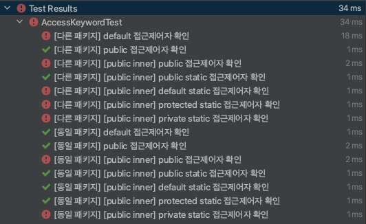
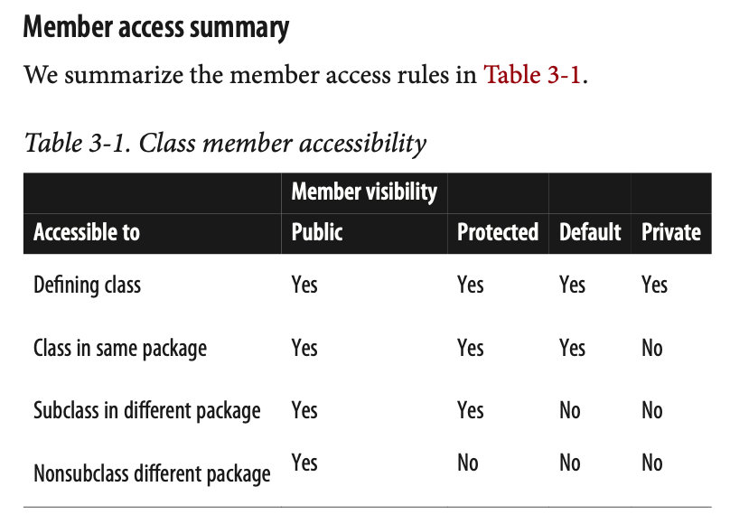

# 5주차 과제: 클래스

> # 목표
>
> 자바의 Class에 대해 학습하세요.
>
> # 학습할 것 (필수)
>
> - 클래스 정의하는 방법
> - 객체 만드는 방법 (new 키워드 이해하기)
> - 메소드 정의하는 방법
> - 생성자 정의하는 방법
> - this 키워드 이해하기


# Class


### 개요

##### Class

- 데이터 값과 해당 값에 대해 작동하는 메서드를 포함하는 명명 된 필드 모음

- Java에서 지원하는 5가지 참조 유형 (arrays, enums, **classes**, **interface**, annotations) 중 한가지

- 새로운 데이터 유형을 정의 (define new data type)


##### Object

- 클래스의 인스턴스
- `new` 키워드와 `생성자` 호출로 클래스를 인스턴스화하여 생성

##### Methods

- 메서드는 다른 Java 코드에서 호출 할 수있는 명명 된 Java 문 시퀀스
- 메서드가 호출되면 인수라고하는 0 개 이상의 값이 전달
- 메서드는 몇 가지 계산을 수행하고 선택적으로 값을 반환
- 메서드 호출은 Java 인터프리터가 평가하는 표현식
- 표현식 문으로도 사용할 수 있음


#### 클래스 정의하는 방법(Defining a Class)

- 클래스 정의는 서명(signature) 과 본문(body) 으로 구성

- 클래스 서명은 클래스의 이름을 정의하고 다른 중요한 정보를 지정(extends, implements) 할 수도 있음

- 클래스의 본문은 중괄호로 묶인 일련의 멤버

  ```java
  /**
   * Represents a Cartesian (x,y) point
   */
  public class Point {
      // 포인트의 좌표
      public double x, y;
  
      public Point(double x, double y) { // 필드를 초기화하는 생성자
          this.x = x;
          this.y = y;
      }
  
      public double distanceFromOrigin() { // x 및 y 필드에서 작동하는 메서드
          return Math.sqrt(x * x + y * y);
      }
  }
  ```

  - 이 클래스 정의는 Point.java라는 파일에 저장
  - Point.class라는 파일로 컴파일되어 Java 프로그램 및 기타 클래스에서 사용할 수 있음

- 클래스의 멤버는 일반적으로 필드와 메서드를 포함하며 생성자, 이니셜 라이저 및 중첩 유형도 포함 할 수 있음

- 멤버는 정적(**static**) 이거나 비정적 (**nonstatic**) 일 수 있음
  - 정적 멤버는 클래스 자체에 속하지만 비 정적 멤버는 클래스의 인스턴스와 연결
  - static : **class fields**, **class methods**
  - notstatic : **instance fields**, **instance methods**

- `extends` 키워드

  - 클래스의 서명은 클래스가 다른 클래스를 확장한다고 선언 할 수 있음

  - 확장 클래스를 수퍼 클래스(superclass) 라고하고 확장을 하위 클래스(subclass)라고 명명함

  - 서브 클래스는 수퍼 클래스의 멤버를 상속하고 새 멤버를 선언하거나 상속 된 메서드를 새 구현으로 재정의 할 수 있음.

  - 예시

    ```java
    public Pizza {
      public void topping() {
        System.out.println("고기, 피망, 버섯, 올리브")
      }
    }
    
    public HawaiianPizza extends Pizza { // suerpclass : Pizze, subclass : HawaiianPizza
      public void topping() {
        System.out.println("파인애플, 햄, 모짜렐라 치즈")
      }
    }
    ```

- `implements` 키워드

  - 하나 이상의 인터페이스를 구현 함을 선언 할 수도 있음

    - **interface** 는 메서드 시그니처 특성을 정의하는 클래스와 유사한 참조 유형이지만 본문을 포함하지 않습니다.

    - **Java 8**부터 인터페이스는 키워드 **default**를 사용하여 인터페이스에 지정된 메서드가 **선택 사항**임을 나타낼 수 있음

      - 예시

        ```java
        public interface DefaultKeyword {
            void must();
        
            default void option() {
                System.out.println("option");
            }
        }
        
        class DefaultKeywordTest {
            @Test
            @DisplayName("default 키워드 인터페이스")
            void defaultKeywordTest() {
                DefaultKeyword impl = new DefaultKeyword() {
                    @Override
                    public void must() {
                        System.out.println("impl 의 must");
                    }
                };
                impl.must();																				// impl 의 must
                impl.option();																			// option
        
                DefaultKeyword impl2 = new DefaultKeyword() {
                    @Override
                    public void must() {
                        System.out.println("impl 의 must");
                    }
        
                    @Override
                    public void option() {
                        System.out.println("impl 의 option");
                    }
                };
                impl2.must();																				// impl 의 must
                impl2.option();																			// impl 의 option
            }
        }
        ```

- 일반 클래스는 정의의 일부로 유형 매개 변수와 와일드 카드를 가질 수도 있음

- 클래스 선언에는 수정 자 키워드가 포함될 수 있음

  - 액세스 제어 수정 자

    - public, protected, default, private

      ```java
      package com.tocgic.exam.study_java_basic.week5.access;
      
      import org.junit.jupiter.api.*;
      
      import javax.annotation.Nonnull;
      import java.lang.reflect.Constructor;
      
      @TestMethodOrder(MethodOrderer.OrderAnnotation.class)
      public class AccessKeywordTest {
          void createInstance(@Nonnull String className) throws Exception {
              Class<?> clazz = Class.forName(className);
              Constructor<?> constructor = clazz.getDeclaredConstructor();
              constructor.newInstance();
          }
      
          @Test
          @Order(1) @DisplayName("[다른 패키지] default 접근제어자 확인")
          void other_defaultClassTest() throws Exception {
              createInstance("com.tocgic.exam.study_java_basic.week5.other.Default");
          }
      
          @Test
          @Order(2) @DisplayName("[다른 패키지] public 접근제어자 확인")
          void other_publicClassTest() throws Exception {
              createInstance("com.tocgic.exam.study_java_basic.week5.other.Public");
          }
      
          @Test
          @Order(3) @DisplayName("[다른 패키지] [public inner] public 접근제어자 확인")
          void other_subPublicClassTest() throws Exception {
              createInstance("com.tocgic.exam.study_java_basic.week5.other.Public$InnerPublic");
          }
      
          @Test
          @Order(4) @DisplayName("[다른 패키지] [public inner] public static 접근제어자 확인")
          void other_subPublicStaticClassTest() throws Exception {
              createInstance("com.tocgic.exam.study_java_basic.week5.other.Public$InnerPublicStatic");
          }
      
          @Test
          @Order(5) @DisplayName("[다른 패키지] [public inner] default static 접근제어자 확인")
          void other_subDefaultStaticClassTest() throws Exception {
              createInstance("com.tocgic.exam.study_java_basic.week5.other.Public$InnerDefaultStatic");
          }
      
          @Test
          @Order(6) @DisplayName("[다른 패키지] [public inner] protected static 접근제어자 확인")
          void other_subProtectedClassTest() throws Exception {
              createInstance("com.tocgic.exam.study_java_basic.week5.other.Public$InnerProtectedStatic");
          }
      
          @Test
          @Order(7) @DisplayName("[다른 패키지] [public inner] private static 접근제어자 확인")
          void other_subPrivateClassTest() throws Exception {
              createInstance("com.tocgic.exam.study_java_basic.week5.other.Public$InnerPrivateStatic");
          }
      
          @Test
          @Order(8) @DisplayName("[동일 패키지] default 접근제어자 확인")
          void defaultClassTest() throws Exception {
              createInstance("com.tocgic.exam.study_java_basic.week5.access.Default");
          }
      
          @Test
          @Order(9) @DisplayName("[동일 패키지] public 접근제어자 확인")
          void publicClassTest() throws Exception {
              createInstance("com.tocgic.exam.study_java_basic.week5.access.Public");
          }
      
          @Test
          @Order(10) @DisplayName("[동일 패키지] [public inner] public 접근제어자 확인")
          void subPublicClassTest() throws Exception {
              createInstance("com.tocgic.exam.study_java_basic.week5.access.Public$InnerPublic");
          }
      
          @Test
          @Order(11) @DisplayName("[동일 패키지] [public inner] public static 접근제어자 확인")
          void subPublicStaticClassTest() throws Exception {
              createInstance("com.tocgic.exam.study_java_basic.week5.access.Public$InnerPublicStatic");
          }
      
          @Test
          @Order(12) @DisplayName("[동일 패키지] [public inner] default static 접근제어자 확인")
          void subDefaultStaticClassTest() throws Exception {
              createInstance("com.tocgic.exam.study_java_basic.week5.access.Public$InnerDefaultStatic");
          }
      
          @Test
          @Order(13) @DisplayName("[동일 패키지] [public inner] protected static 접근제어자 확인")
          void subProtectedClassTest() throws Exception {
              createInstance("com.tocgic.exam.study_java_basic.week5.access.Public$InnerProtectedStatic");
          }
      
          @Test
          @Order(14) @DisplayName("[동일 패키지] [public inner] private static 접근제어자 확인")
          void subPrivateClassTest() throws Exception {
              createInstance("com.tocgic.exam.study_java_basic.week5.access.Public$InnerPrivateStatic");
          }
      }
      ```
      
      
      
      
      
    - 참고 (Java in a Nutshell, 7th Edition p.133)
      
  
  - abstract
  
    - 추상 클래스는 구현이 불완전하고 인스턴스화 할 수없는 클래스
    - 하나 이상의 추상 메서드가있는 모든 클래스를 선언해야함
  
  - final
  
    - 최종 수정자는 클래스가 확장되지 않을 수 있음을 지정
    - 클래스는 추상 및 최종 클래스로 선언 될 수 없음
  
  - strictfp (Strict Floating Point)
  
    - 클래스가 strictfp로 선언되면 모든 메서드가 strictfp로 선언 된 것처럼 동작
    - 부동 소수점 표준의 형식적 의미를 정확히 따름
    - 거의 사용되지 않음
  
- 필드/메소드 제어자

  : 데이터는 필드에 저장, 코드는 메서드로 구성

  - 유형

    - 클래스 멤버 (정적 멤버라고도 함)는 클래스 자체와 연결

      - Class fields

      - Class methods

        > 클래스 메서드는 인스턴스 필드 또는 인스턴스 메서드를 사용할 수 없음

    - 인스턴스 멤버는 클래스의 개별 인스턴스 (즉, 개체)와 연결

      - Instance fields

      - Instance methods

        > 인스턴스 메서드 내에서 메서드가 호출 된 개체에 속하는 모든 인스턴스 필드에 액세스 할 수 있음
        > 객체는 상태 (객체의 필드로 표시됨) 및 동작 (해당 상태에서 작동하는 메서드)을 포함하는 번들로 간주
        > 모든 인스턴스 메서드는 메서드 서명에 표시되지 않은 `암시 적 매개 변수` (**this**) 를 사용하여 구현
        > 메소드가 호출되는 오브젝트에 대한 참조를 보유

  - 필드 선언 구문

    - 필드 선언 구문은 필드 정의에 수정자가 포함될 수 있다는 점을 제외하면 지역 변수를 선언하는 구문과 유사함
    - 필드 유형과 필드 이름으로 구성
      - 유형은 0 개 이상의 수정 자 키워드 또는 주석이 앞에 올 수 있음
      - 이름 뒤에는 필드의 초기 값을 제공하는 등호 및 이니셜 라이저 표현식이 올 수 있음
      - 둘 이상의 필드가 동일한 유형 및 수정자를 공유하는 경우 유형 뒤에 쉼표로 구분 된 필드 이름 및 이니셜 라이저 목록이 올 수 있음
    - **필드 수정 자 키워드**는 다음 키워드 중 0 개 이상으로 구성
      - public*,* protected*,* private
        필드를 정의하는 클래스 외부에서 필드를 사용할 수 있는지 여부와 위치를 지정
      - static
        존재하는 경우이 수정자는 필드가 클래스의 각 인스턴스가 아닌 정의 클래스 자체와 연관되도록 지정
      - final
        필드가 초기화되면 해당 값이 변경되지 않도록 지정
        정적 필드와 최종 필드는 javac가 인라인 할 수있는 컴파일 타임 상수
        final 필드는 인스턴스가 변경 불가능한 클래스를 만드는데도 사용할 수 있음
      - transient
        필드가 객체의 영구 상태의 일부가 아니며 나머지 객체와 함께 직렬화 될 필요가 없음을 지정
      - volatile
        이 수정자는 필드에 둘 이상의 스레드가 동시에 사용할 수있는 추가 의미가 있음을 의미
        volatile 한정자는 필드의 값을 항상 주 메모리에서 읽고 플러시해야하며 스레드 (레지스터 또는 CPU 캐시에서)에 의해 캐시되지 않을 수 있음


#### 객체 만드는 방법(Creating an Object)
- `new` 연산자는 클래스의 `새 인스턴스를 만들어야 함`을 의미
  - 새 개체 인스턴스를 보유하기 위해 메모리가 할당
  - 다음 지정된 인수와 함께 **생성자 본문 호출**
  - **생성자**는 이러한 인수를 사용하여 **필요한 새 개체의 초기화**를 수행

> Java의 모든 클래스에는 하나 이상의 생성자 (새 객체에 필요한 초기화를 수행) 가 존재함
>
> 프로그래머가 클래스의 생성자를 명시 적으로 정의하지 않으면 javac 컴파일러는 인수를 취하지 않고 특별한 초기화를 수행하지 않는 생성자 (기본 생성자라고 함)를 자동으로 생성


#### 메소드 정의하는 방법(Defining Methods)

- 중괄호로 묶인 임의의 일련의 명령문

  - 방법의 이름
  - 메서드에서 사용하는 매개 변수의 번호, 순서, 유형 및 이름
  - 메서드에서 반환 된 값의 유형
  - 메서드가 throw 할 수있는 확인 된 예외 (서명에 확인되지 않은 예외가 나열 될 수도 있지만 필수 사항은 아님)
  - 방법에 대한 추가 정보를 제공하는 다양한 방법 수정 자

- 메서드 서명은 메서드를 호출하기 전에 메서드에 대해 알아야 할 모든 것을 정의

  > **modifiers type** *name* (*paramlist* ) [ **throws** exceptions ]

- Method Modifiers

  - abstract
    추상 메서드는 구현이없는 사양
    일반적으로 메서드 본문을 구성하는 중괄호 및 Java 문은 단일 세미콜론으로 대체
    **추상 메서드를 포함하는 클래스는 자체적으로 추상으로 선언되어야함**
    이러한 클래스는 불완전하며 인스턴스화 할 수 없음
  - final
    최종 메서드는 하위 클래스에 의해 재정의되거나 숨겨지지 않을 수 있음
    일반 메서드에서는 불가능한 컴파일러 최적화를 수행 할 수 있음
    final로 선언 된 모든 클래스의 모든 메서드와 마찬가지로 모든 **private 메서드는 암시 적으로 final**
  - native
    native 한정자는 메소드 구현이 C와 같은 일부 `네이티브` 언어로 작성되고 **Java 프로그램에 외부 적으로 제공되도록 지정**
    추상 메서드와 마찬가지로 네이티브 메서드에는 본문이 없음
    중괄호는 세미콜론으로 대체
  - public*,* protected*,* private
  - static
  - strictfp
  - synchronized
    동기화 된 수정자는 메서드를 **스레드로부터 안전하게 만듬**
    스레드가 동기화 된 메서드를 호출하려면 먼저 메서드의 클래스 (정적 메서드의 경우) 또는 클래스의 관련 인스턴스 (비 정적 메서드의 경우)에 대한 잠금을 얻어야함. 이렇게하면 두 스레드가 동시에 메서드를 실행하지 못합니다.

  

#### 생성자 정의하는 방법(Defining a Constructor)

> - 생성자 이름은 항상 클래스 이름과 동일
> - 생성자는 반환 유형없이 선언 (void 자리 표시 자도 사용하지 않음)
> - 생성자의 본문은 객체를 초기화하는 코드
> - 생성자는이 값 (또는 다른 값)을 반환하지 않음

- 기본 생성자

  ```java
  public class Circle {
  	//기본 생성자 (초기화 코드가 없는 경우 생략 가능)
  	public Circle() {}
  }
  ```

- 여러 생성자

  ```java
  public class Circle {
    double r;
    public Circle() {}
    public Circle(double r) {
      this.r = r;
    }
  }
  ```

- 다른 생성자에서 하나의 생성자 호출

  ```java
  public class Circle {
    double r;
    public Circle() {
      this(1.0); // this 키워드를 이용해, 다른 생성자를 호출해 줄 수 있음. 가장 먼저 수행 되어야 함
    }
    public Circle(double r) {
      this.r = r;
    }
  }
  ```

- Subclass 생성자 (super 의 사용)

  ```java
  public class Circle {
  	double r;
  	public Circle(double r) {
  		this.r = r;
  	}
  }
  
  public class PlaneCircle {
    double cx, cy;
  	PlaneCircle(double r, double x, double y) {
  		super(r); // Invoke the constructor of the superclass, Circle()
      this.cx = x; // Initialize the instance field cx
      this.cy = y; // Initialize the instance field cy
  }
  ```

  

> **필드 기본값 및 초기화**
>
> **인스턴스 필드**와 **클래스 필드** 모두 필드는 반드시 **초기화가 필요하지 않음**
> 초기 값이 지정되지 않은 경우 필드는 유형에 따라 기본값 인 `false`, `\u0000`, `0`, `0.0`, `null` 로 자동 초기화 됨


#### this 키워드 이해하기

- 암시 적 this 매개 변수
  - 일반적으로 필요하지 않기 때문에 메서드 서명에 표시되지 않음
  -  Java 메소드가 해당 클래스의 인스턴스 필드에 액세스 할 때마다이 매개 변수가 참조하는 객체의 필드에 액세스한다는 것은 암시 적행위
  - "현재 객체에서 인스턴스 메서드를 호출"한다는 의미로 간주
  - 메서드가 **자체 필드** 및 또는 **메서드**에 액세스하고 있음을 분명히하려면 this 키워드를 명시 적으로 사용
- this 메소드
  - 2개 이상의 생성자를 사용하는 경우, 파라미터 갯수 및 타입이 일치하는 생성자를 this 키워드를 사용하여 호출 할 수 있음
  - 생성자에서 사용할 수 있으며, 생성자 내 최 상단에서 호출되어야 한다.


