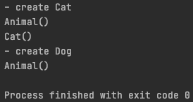
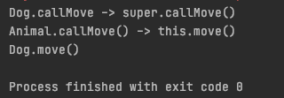

# 6주차 과제: 상속

> # 목표
>
> 자바의 상속에 대해 학습하세요.
>
> # 학습할 것 (필수)
>
> - 자바 상속의 특징
> - super 키워드
> - 메소드 오버라이딩
> - 다이나믹 메소드 디스패치 (Dynamic Method Dispatch)
> - 추상 클래스
> - final 키워드
> - Object 클래스
> - (option) Double Dispatch


# 상속

객체 지향의 4대 특성 (캡슐화, **상속**, 추상화, 다형성) 중 하나.

상위 클래스의 메소드와 필드를 하위 클래스(subclass) 에서 물려 받는 는 것이 며, :heavy_plus_sign: 알파 (필드&메소드 의 추가, ..,) 가 가능하게 된다.

> 하위 클래스 **is a kind of** 상위 클래스상위

클래스는 하위 클래스보다 더 (일반화된) **큰 분류** 로 볼수 있으며,
하위 클래스는 상위 클래스보다 더 **상세한 분류**로 볼 수있다.

상속을 사용하는 이유는 **클래스를 확장하여 재사용** 의 목적으로 사용한다.


#### 자바 상속의 특징

1. 다중 상속을 허용하지 않음
   자바는 상속의 표현으로  **extends** {상위 클래스} 를 사용하여 표현 하는데, 이때, 상위 클래스는 한개만 가능.
   단, 여러 하위 클래스는 동일한 상위 클래스를 가질 수 있다.

2. 상속 횟수 제한 없음
   어떤 상위 클래스를 상속하는 하위 클래스가 있다면, 이 하위 클래스는 다시, 어떤 클래스의 상위 클래스가 될 수 있음

3. 최상위 클래스 는 java.lang.Object 클래스
   extends 를 사용하지 않은 class 라 하더라도, 암묵적으로 Object 를 상속함

   상위 클래스는 하위 클래스 보다 (일반화된) 큰 분류 이므로, 상위 클래스 데이터 타입은 하위 클래스를 취급 할 수 있다.

   따라서, Object 클래스는 모든 클래스를 취급할 수 있다.


#### super 키워드

상속 관계에서, 상위 클래스를 표현하는 예약어

- 생성자의 **super()**

  서브 클래스 생성자 내에서 상위 클래스의 생성자를 호출

  - super()는 생성자 내에서만 사용할 수 있음

  - 상위 클래스 생성자에 대한 호출은 지역 변수 선언 이전에도 생성자 내에서 **첫 번째 문**으로 사용 되어야 함
    1. Java는 클래스의 인스턴스가 생성 될 때마다 클래스의 생성자가 호출되도록 보장

    2. 하위 클래스의 인스턴스가 생성 될 때마다 생성자가 호출되도록 보장

       > 이 두 번째 지점을 보장하기 위해 Java는 모든 생성자가 **상위 클래스 생성자를 호출**하도록 처리 해야 함.
       >
       > 생성자의 첫 번째 문이 this() 또는 super()를 사용하여 다른 생성자를 명시 적으로 호출하지 않는 경우
       > javac 컴파일러는 super() 호출을 삽입 (즉, 인수없이 상위 클래스 생성자를 호출)

    즉, `Constructor Chaining`

    ```java
    public class Animal {
        public Animal() {
            System.out.println("Animal()");
        }
    }
    
    public class Cat extends Animal {
        public Cat() {
            System.out.println("Cat()");
        }
    }
    
    public class Dog extends Animal {
    }
    ```

    ```java
    @Test
    void constructorChaining() {
        System.out.println("- create Cat");
        new Cat();
        System.out.println("- create Dog");
        new Dog();
    }
    ```

    


- **super**

  메소드, 필드에서 상위 클래스 를 지시

  - **super.**{메소드}
  - **super.**{필드}

  클래스 메소드 (static) 에서 사용할 수 없음


#### 메소드 오버라이딩

객체 지향의 4대 측성 중, 다형성(polymorphism) 에 해당.

> 다형성 : 하위 클래스가, 상위 클래스로 부터 물려 받은 형질을 customizing 하는 것

상속의 관계에 있는 클래스간, 하위 클래스가 상위 클래스와 `완전 동일한 메소드`를 덮어쓴다의 의미

> 완전 동일한 메소드 : 이름과 반환형이 같으면서 매개변수의 개수와 타입이 모두 같은 메소드

`인스턴스 메소드 만 가능` (클래스 메소드는 오버라이딩 불가)

| | 상위 클래스 클래스 메소드 | 상위 클래스 인스턴스 메소드 |
| ---- | --------------------------- | ---- |
| 하위 클래스 클래스 메소드  | hides | compile error |
| 하위 클래스 인스턴스 메소드 | compile error | Overrides |

- hide: 호출되는 숨겨진 정적 메서드의 버전은 상위 클래스에서 호출되는지 또는 하위 클래스에서 호출되는지에 따라 다릅니다.

- overrides : 호출되는 재정의 된 인스턴스 메서드의 버전은 하위 클래스에있는 것입니다.

  ```java
  public class Animal {
      public void callMove() {
          System.out.println("Animal.callMove() -> this.move()");
          this.move();
      }
  
      public void move() {
          System.out.println("Animal.move()");
      }
  }
  
  public class Dog extends Animal {
      @Override
      public void callMove() {
          System.out.println("Dog.callMove -> super.callMove()");
          super.callMove();
      }
  
      @Override
      public void move() {
          System.out.println("Dog.move()");
      }
  }
  ```

  ```java
  @Test
  void overridingTest() {
      Dog dog = new Dog();
      dog.callMove();
  }
  ```

  


#### 

#### Method Dispatch

어떤 메소드를 호출할지 결정하여 실제로 실행시키는 과정

- Static Dispatch
  컴파일 시점에서, 컴파일러가 특정 메소드를 호출할 것 을 명확히 알고있는 경우

  - 컴파일 시 생성된 바이트코드에 정보가 남아있음

  - 런타임이 되지 않아도 미리 결정
  - 함수를 overloading 으로 사용하는 경우

  ```java
  Sub sub = new Sub();
  ```

  

- Dynamic Method Dispatch (다이나믹 메소드 디스패치)

  Interface 나 abstract class 에서 정의된 abstract method 를 호출하는 경우

  - 하위 클래스는 상위 인터페이스에서 정의된 메소드를 반드시 Overriding 하여 구현

  ```java
  Super super = new Sub();
  ```

  > 메서드 호출 과정
  >
  > 1. receiver parameter
  >    super 라는 object 의 this 라는 키워드로 쓰이는 요소가 파라미터 (receiver parameter) 로 자동으로 들어가게 됨
  >    소스 상 보이지 않으나, 자바 스펙에 기술되어있음
  >
  >    Super super = new Sub();
  >    super.a();
  >    의 경우, a() 호출 시 receiver parameter 는 **new Sub()** 에서 생성된 객체의 this 가 해당된다.
  >
  > 2. Method Reference 를 통해 하위 클래스의 메서드를 실행시킨다.

  

- Double Dispatch

  Dispatch 가 연속적으로 이루어 지는 것을 의미

  - 이를 사용하는 대표적인 Pattern - Visitor Pattern

  ```java
  Visitor v = new ConcreteVisitor();
  Element e = new ConcreteElement();
  e.accept(v);
  ```

  > 1. e 는 추상타입인 Element의 레퍼런스로서, 인터페이스 이므로 e.accept() 수행시 **new ConcreteElement()** 의 인스턴스가 **receiver parameter** 로 전달 된다
  >
  > 2. Dynamic Dispatch 를 통해, ConcreteElement에 정의된 accept() 가 수행
  >
  >    public void accept(**Visitor** v) {
  >
  >    ​    v.**visitConcreteElement**(this);  //Double Dispatch
  >
  >    }
  >
  >    accept() 에서, 다시 추상 객체인 Visitor를 인자로 받아, Visitor 에 정의된 visitConcreteElement 를 수행하기 위해 Dynamic Dispatch 이루어 진다.
  >
  >    	1. **new ConcreteVisitor()** 의 인스턴스가 **receiver paramter** 로 전달
  >     	2. Dynamic Dispatch 를 통해, ConcreteVisitor 에 정의된 visitConcreteElement(ConcreteElement ce) 를 수행

  즉, 

  1. Element# accept(Visitor visitor) 실행
  2. ConcreteElement# accept(Visitor visitor) 실행 // Dynamic Dispatch #1
  3. ConcreteVisitor# visitConcreteElement(ConcreteElement ce) // Dynamic Dispatch #2


#### 추상 클래스

- 여러 클래스 간, 비슷한 필드와 메서드를 공통적으로 추출해 규격을 잡아놓은 클래스

- 실체 클래스 객체를 생성할 정도의 구체성을 갖는 반명, 직접 **객체를 생성할 순 없다**.
- 상속을 통한 확장 구현 - 추상클래스와 실체클래스는 상속적인 관계

> - Template Pattern 에 주로 사용
>
> - java 8 이후, interface 의 **default** 예약어가 추가되어, 효용성 떨어 짐

> public **abstract** class 클래스명 {
>     // 필드
>     // 생성자
>     // 메서드
>     // 추상메서드
>     [엑세스 제어 수정자] **abstract** [리턴타입] 메서드명(매개변수, ...);
>
> }


#### final 키워드

- final method : 오버라이딩 불가
- final class : 오버라이딩 불가 (상위 클래스 될 수 없음)
- final field : 상수 취급
  - 변경 불가
  - 선언후, 사용전, 값 할당이 되어야 함


#### Object 클래스

모든 클래스 의 시조

> 모든 클래스가 **공통**으로 포함하고 있어야 하는 **기능**을 **제공**하기 위함
>
> Class Hierarchy
> https://docs.oracle.com/en/java/javase/15/docs/api/java.base/java/lang/package-tree.html

- toString()
  객체를 문자로 표현하는 메소드
- equals(Object obj)
  equals는 객체와 객체가 같은 것인지를 비교하는 API
  객체 간에 같고 다름은 필요에 따라서 달라질 수 있기 때문
- finalize() - **Deprecated** (jdk15)
  finalize는 객체가 소멸될 때 호출되기로 약속된 메소드
  많은 자바의 전문가들이 이 메소드의 사용을 만류
- clone()
  복제. 어떤 객체가 있을 때 그 객체와 똑같은 객체를 복제해주는 기능


> 참고
>
> Java in a Nutshell, 7th Edition
> https://velog.io/@polynomeer/JAVA%EC%9D%98-%EC%98%A4%EB%B2%84%EB%9D%BC%EC%9D%B4%EB%94%A9Override
> https://defacto-standard.tistory.com/413
> https://limkydev.tistory.com/188
> https://docs.oracle.com/en/java/javase/15/docs/api/java.base/java/lang/Object.html
> https://opentutorials.org/course/1223/6241