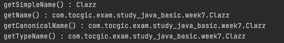
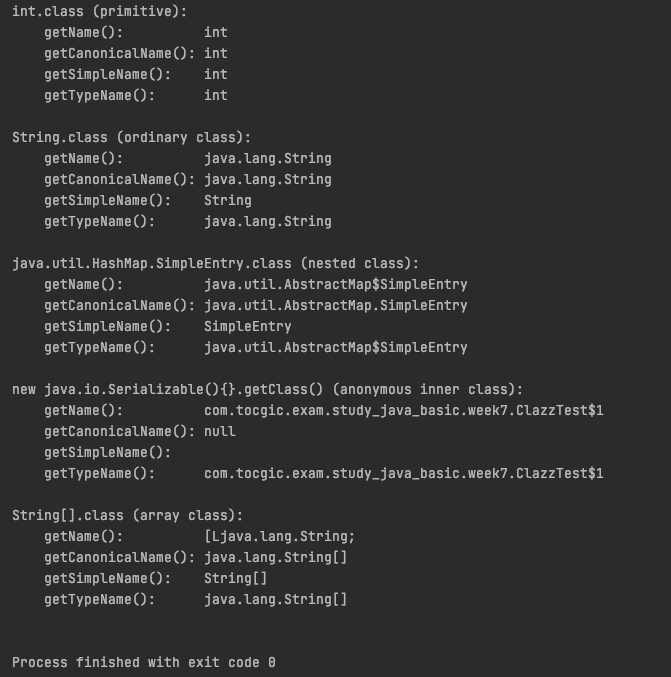
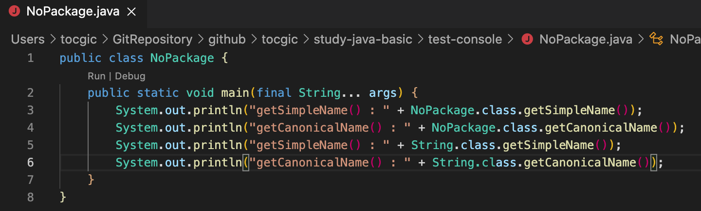
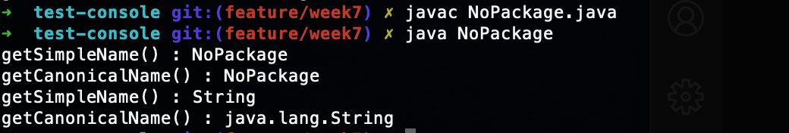
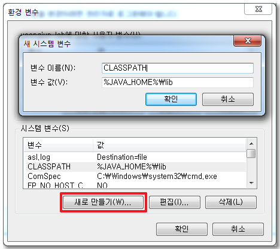
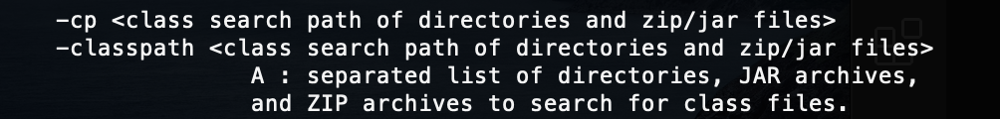
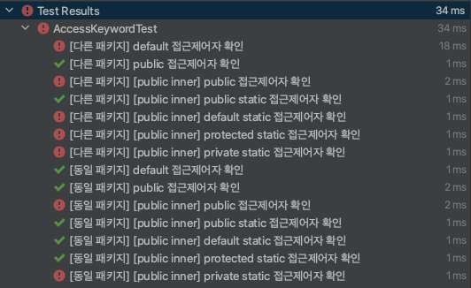

# 7주차 과제: 패키지

> # 목표
>
> 자바의 패키지에 대해 학습하세요.
>
> # 학습할 것 (필수)
>
> - package 키워드
> - import 키워드
> - 클래스패스
> - CLASSPATH 환경변수
> - -classpath 옵션
> - 접근지시자


# 패키지

패키지는 클래스, 인터페이스 및 기타 참조 유형의 명명 된 모음
패키지는 관련 클래스를 그룹화하고 포함 된 클래스에 대한 네임 스페이스를 정의하는 역할

> Java 플랫폼의 핵심 클래스는 이름이 java로 시작하는 패키지에 존재함
>
> - java.lang : 가장 기본적인 언어 클래스 포함
> - java.util : 다양한 유틸리티 클래스 포함
> - java.io : 입력 및 출력 클래스 포함
> - java.net : 네트워킹 클래스 포함
>
> 표준화 된 Java 플랫폼에 대한 확장에는 일반적으로 javax로 시작하는 패키지도 존재함
>
> - javax.swing
> - 확장 패키지 중 일부는 나중에 핵심 플랫폼에 채택되기도 함
>
> 패키지를 만든 표준 기관의 이름을 딴 패키지가있는 여러 "보증 된 표준"도 포함되어 있음
>
> - org.w3c 및 org.omg


모든 클래스에는 두가지 이름이 있음

- 간단한 이름 (a simple name) : 정의에 지정된 이름

- 정규화 된 이름 (a fully qualified name) : 해당 클래스가 속한 패키지의 이름을 포함하는 이름

  > `String` vs ` java.lang.String`

- **getName()** vs **getCanonicalName()** vs **getSimpleName()** vs **getTypeName()**

  - 일반적인 클래스를 생성하여, 값을 찍어보면, 아래와 같이, getSimpleName() 을 제외한 나머지 값들은 패키지 이름이 포함되어 출력이 된다.

    ```java
        @Test
        void name() {
            System.out.println("getSimpleName() : " + Clazz.class.getSimpleName());
            System.out.println("getName() : " + Clazz.class.getName());
            System.out.println("getCanonicalName() : " + Clazz.class.getCanonicalName());
            System.out.println("getTypeName() : " + Clazz.class.getTypeName());
        }
    ```

  

  - 다른 나머지는 어떤 차이가 있는 것일까? stackoverflow 를 검색해 보았다.

    > 참조
    >
    > - https://stackoverflow.com/questions/15202997/what-is-the-difference-between-canonical-name-simple-name-and-class-name-in-jav
    > - https://javahowtodoit.wordpress.com/2014/09/09/java-lang-class-what-is-the-difference-between-class-getname-class-getcanonicalname-and-class-getsimplename/

    ```java
        @Test
        void name2() {
            printNamesForClass(
                    int.class,
                    "int.class (primitive)");
            printNamesForClass(
                    String.class,
                    "String.class (ordinary class)");
            printNamesForClass(
                    java.util.HashMap.SimpleEntry.class,
                    "java.util.HashMap.SimpleEntry.class (nested class)");
            printNamesForClass(
                    new java.io.Serializable(){}.getClass(),
                    "new java.io.Serializable(){}.getClass() (anonymous inner class)");
            printNamesForClass(
                    String[].class,
                    "String[].class (array class)");
         }
    
        private void printNamesForClass(final Class<?> clazz, final String label) {
            System.out.println(label + ":");
            System.out.println("    getName():          " + clazz.getName());
            System.out.println("    getCanonicalName(): " + clazz.getCanonicalName());
            System.out.println("    getSimpleName():    " + clazz.getSimpleName());
            System.out.println("    getTypeName():      " + clazz.getTypeName()); // added in Java 8
            System.out.println();
        }
    ```

    

    - getName()
      Class 객체가 나타내는 엔티티 (클래스, 인터페이스, 배열 클래스, 기본 유형 또는 void)의 이름을 문자열로 반환
    - getCanonicalName()
      Java 언어 사양에 정의 된 기본 클래스의 정식 이름을 반환 ( `$` 대신 `.` 표시 ) (-> **import 문에 사용되는 이름**)
      익명클래스는 null 반환
    - getSimpleName()
      소스 코드에 지정된 이름 인 기본 클래스의 간단한 이름을 반환
      익명클래스는 값이 없음
    - getTypeName() - java 8 에 추가됨
      array 인 경우, getName() 의 `[L`~~`;` 대신, 뒤에 `[]` 를 표시


#### package 키워드

클래스가 속할 패키지를 지정하기 위해, 패키지 선언시 package 키워드 사용

```java
package org.apache.commons.net;
```

-  Java 파일에서 Java 코드의 첫 번째 토큰 (즉, 주석 및 공백을 제외한 첫 번째 항목)이어야함
  
- 키워드 뒤에는 원하는 패키지 이름과 세미콜론이 와야함
  
- Java 파일에 패키지 지시문이 없으면, 해당 파일에 정의 된 모든 클래스는 **이름이 지정되지 않은 패키지**에 속하게 됨.

  - 이 경우 클래스의 규정 된 이름과 규정되지 않은 이름은 동일
    

    

- 패키지 이름은 java 로 시작할 수 없음

- 패키지 이름과 폴더 구조가 같아야 함

- 모든 패키지 이름의 접두사로 요소가 반전 된 도메인 이름을 사용

- 패키지 이름 규칙

  - 소문자 작성
  - 예약어 사용할 수 없음


##### 목적

- Java 네임 스페이스를 분할하고 클래스 간의 이름 충돌을 방지

  > java.util.List 및 java.awt.List 클래스를 구별하는 것은 패키지 이름


#### import 키워드

다른 패키지의 클래스를 사용할때 import 키워드를 사용한다.

```java
package com.tocgic.exam.study_java_basic.week7;
import com.tocgic.exam.study_java_basic.week7_sub.Print;
import static com.tocgic.exam.study_java_basic.week7_sub.Print.staticPrint;
import static com.tocgic.exam.study_java_basic.week7_sub.Print.NAME;

public class ImportTest {
    public void callMethod() {
        new Print().print();
        new com.tocgic.exam.study_java_basic.week7_sub.Print2().print(); //import 를 하지 않으면, canonicalName 사용
    }

    public void callStaticMethod() {
        Print.staticPrint();
        com.tocgic.exam.study_java_basic.week7_sub.Print2.staticPrint(); //import 를 하지 않으면, canonicalName 사용
    }

    public void callStaticImported() {
        staticPrint(); // 클래스 메소드를 import static 를 이용하여 import 하여 직접 사용
        System.out.println("NAME : " + NAME); // 클래스 속성을 import static 를 이용하여 import 하여 직접 사용
    }
}
```

- import static
  클래스 메소드나, 클래스 속성을 직접 import 하여, **클래스명 없이 직접 사용** 할 수 있도록 제공
- import 불필요 패키지
  - 동일 패키지
  - java.lang 패키지


#### 클래스패스

- JVM이 프로그램을 실행할 때, 클래스파일을 찾는 경로
- .class 파일이 포함된 디렉토리와 파일을 콜론`:` 으로 구분한 목록
- java runtime 이 classpath 에 지정된 경로를 검색하여 특정 클래스에 대한 코드가 포함된 .class 파일을 찾는다.
- classpath 지정 방법
  - 환경 변수 CLASSPATH 사용
  - java runtime 에 -classpath 플래그 사용
- 사용 가능 값
  - `:` 으로 구분된 디렉토리 및 파일 목록
    - 디렉토리
    - zip 파일
    - jar 파일 (자바 아카이브)


#### CLASSPATH 환경변수

windows 나 유닉스 계열등 운영체제에 따라 환경 변수 등록하는 방법에는 차이가 있으나,

각 운영체제 환경에 맞게, [사용자 변수 or 시스템 변수] 에 CLASSPATH를 등록 한다.

- 변수이름 : CLASSPATH
- 값 : `java home 경로`/**lib** (추가 하고 싶은 pass가 있는 경우, `:` 을 상용하여, 경로 추가. windows 는 `;`)




#### -classpath 옵션

- java runtime 시 classpath 를 설정하는 옵션

  ```shell
  $ javac -cp {참조 경로} {컴파일 java파일}
  $ javac -classpass {참조 경로} {컴파일 java파일}
  ```

  

  ```shell
  $ java -cp {참조 경로} {실행 class 파일}
  $ java -classpass {참조 경로} {실행 class 파일}
  ```

  


#### 접근지시자

- public
   : 누구나 접근 가능

- protected
   : 동일 패키지 or 확장된 하위클래스

- default
   : (접근자 지정 하지 않은 경우), 같은 패키지 내에서 접근 가능

- private
   : 해당 클래스만 사용가능

- 요약

  |           | 같은 클래스 | 같은 패키지 | 확장된 하위클래스 | import 클래스 |
  | :-------: | :---------: | :---------: | :---------------: | :-----------: |
  |  public   |      O      |      O      |         O         |       O       |
  | protected |      O      |      O      |         O         |       X       |
  |  default  |      O      |      O      |         X         |       X       |
  |  private  |      O      |      X      |         X         |       X       |

- 동작 확인

  ```java
  @TestMethodOrder(MethodOrderer.OrderAnnotation.class)
  public class AccessKeywordTest {
      void createInstance(@Nonnull String className) throws Exception {
          Class<?> clazz = Class.forName(className);
          Constructor<?> constructor = clazz.getDeclaredConstructor();
          constructor.newInstance();
      }
  
      @Test
      @Order(1) @DisplayName("[다른 패키지] default 접근제어자 확인")
      void other_defaultClassTest() throws Exception {
          createInstance("com.tocgic.exam.study_java_basic.week5.other.Default");
      }
  
      @Test
      @Order(2) @DisplayName("[다른 패키지] public 접근제어자 확인")
      void other_publicClassTest() throws Exception {
          createInstance("com.tocgic.exam.study_java_basic.week5.other.Public");
      }
  
      @Test
      @Order(3) @DisplayName("[다른 패키지] [public inner] public 접근제어자 확인")
      void other_subPublicClassTest() throws Exception {
          createInstance("com.tocgic.exam.study_java_basic.week5.other.Public$InnerPublic");
      }
  
      @Test
      @Order(4) @DisplayName("[다른 패키지] [public inner] public static 접근제어자 확인")
      void other_subPublicStaticClassTest() throws Exception {
          createInstance("com.tocgic.exam.study_java_basic.week5.other.Public$InnerPublicStatic");
      }
  
      @Test
      @Order(5) @DisplayName("[다른 패키지] [public inner] default static 접근제어자 확인")
      void other_subDefaultStaticClassTest() throws Exception {
          createInstance("com.tocgic.exam.study_java_basic.week5.other.Public$InnerDefaultStatic");
      }
  
      @Test
      @Order(6) @DisplayName("[다른 패키지] [public inner] protected static 접근제어자 확인")
      void other_subProtectedClassTest() throws Exception {
          createInstance("com.tocgic.exam.study_java_basic.week5.other.Public$InnerProtectedStatic");
      }
  
      @Test
      @Order(7) @DisplayName("[다른 패키지] [public inner] private static 접근제어자 확인")
      void other_subPrivateClassTest() throws Exception {
          createInstance("com.tocgic.exam.study_java_basic.week5.other.Public$InnerPrivateStatic");
      }
  
      @Test
      @Order(8) @DisplayName("[동일 패키지] default 접근제어자 확인")
      void defaultClassTest() throws Exception {
          createInstance("com.tocgic.exam.study_java_basic.week5.access.Default");
      }
  
      @Test
      @Order(9) @DisplayName("[동일 패키지] public 접근제어자 확인")
      void publicClassTest() throws Exception {
          createInstance("com.tocgic.exam.study_java_basic.week5.access.Public");
      }
  
      @Test
      @Order(10) @DisplayName("[동일 패키지] [public inner] public 접근제어자 확인")
      void subPublicClassTest() throws Exception {
          createInstance("com.tocgic.exam.study_java_basic.week5.access.Public$InnerPublic");
      }
  
      @Test
      @Order(11) @DisplayName("[동일 패키지] [public inner] public static 접근제어자 확인")
      void subPublicStaticClassTest() throws Exception {
          createInstance("com.tocgic.exam.study_java_basic.week5.access.Public$InnerPublicStatic");
      }
  
      @Test
      @Order(12) @DisplayName("[동일 패키지] [public inner] default static 접근제어자 확인")
      void subDefaultStaticClassTest() throws Exception {
          createInstance("com.tocgic.exam.study_java_basic.week5.access.Public$InnerDefaultStatic");
      }
  
      @Test
      @Order(13) @DisplayName("[동일 패키지] [public inner] protected static 접근제어자 확인")
      void subProtectedClassTest() throws Exception {
          createInstance("com.tocgic.exam.study_java_basic.week5.access.Public$InnerProtectedStatic");
      }
  
      @Test
      @Order(14) @DisplayName("[동일 패키지] [public inner] private static 접근제어자 확인")
      void subPrivateClassTest() throws Exception {
          createInstance("com.tocgic.exam.study_java_basic.week5.access.Public$InnerPrivateStatic");
      }
  }
  ```

  


  


> 참고
>
> Java in a Nutshell, 7th Edition
> https://effectivesquid.tistory.com/entry/%EC%9E%90%EB%B0%94-%ED%81%B4%EB%9E%98%EC%8A%A4%ED%8C%A8%EC%8A%A4classpath%EB%9E%80