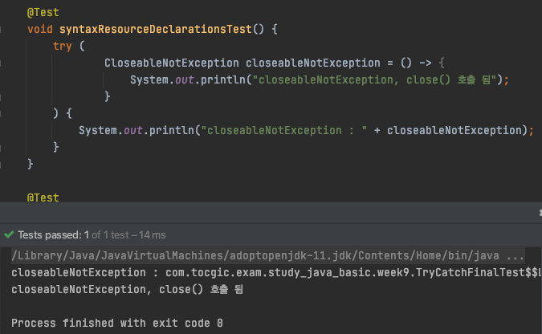
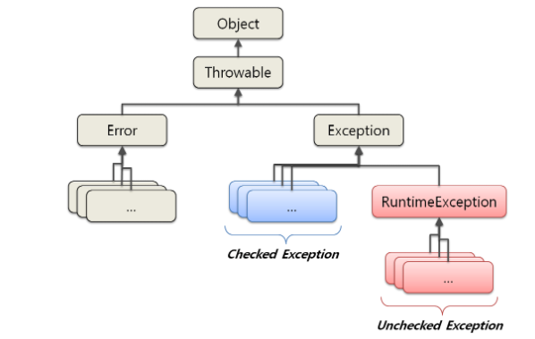

# 9주차 과제: 예외 처리

> # 목표
>
> 자바의 예외 처리에 대해 학습하세요.
>
> # 학습할 것 (필수)
>
> - 자바에서 예외 처리 방법 (try, catch, throw, throws, finally)
> - 자바가 제공하는 예외 계층 구조
> - Exception과 Error의 차이는?
> - RuntimeException과 RE가 아닌 것의 차이는?
> - 커스텀한 예외 만드는 방법


# 예외 처리


### 자바에서 예외 처리 방법 (try, catch, throw, throws, finally)

----

#### try {} catch {} finally {}

- `try`

  - 예외를 처리할 대상 코드의 범위를 try 블럭으로 지정

  - try 블럭 내 코드 중 예외가 발생하는 시점에서 이후의 코드는 수행되지 않으며, `catch 블럭` -> `finally 블럭` 순으로 수행됨

  - `try` AND (`catch` OR `finally`)

    try 사용시, catch 나 finally 중 하나 이상 은 필수
    

    - error: 'try' without **'catch'**, **'finally'** or **resource declarations**

      > 컴파일 오류. 10 번째 라인의 try 에 'catch', 'finally' <u>or `resource declarations`</u> 없어 발생

      에러메세지를 보면, catch 나 finally 를 추가하면, 컴파일 에러를 해결 할 수 있다.
      그런데, or resource declarations 은 어떤 뜻일까?
      `resource declarations` 를 사용하면, catch, finally 를 쓰지 않아도 컴파일 오류가 발생하지 않을 수 있다?


### [실험] try 사용시, catch & finally 없이 컴파일 오류를 발생하지 않도록 할 수 있을까?

> 위, 에러 메세지를 보면, Resource declarations 을 사용하면, 컴파일 오류를 해결 할 수 있을 것 같다.
> 검색을 해보면, **try-with-resources** 를 의미 하는 것으로 판단된다.

```
* try-with-resources (TWR) - Java7
: TWR 구문을 사용하면, try (...) 안에서 AutoCloseable 인터페이스를 구현한 객체는, try 블록이 종료될때, close() 메소드를 호출함 
```

> `try (...)` 에 사용할 수 있는 객체는 AutoCloseable 인터페이스를 구현한 객체만 가능한데,
> AutoCloseable 의 close() 는 Exception을 throws 하도록 명시되어있음
>
> ```java
> public interface AutoCloseable {
>     void close() throws Exception;
> }
> ```
>
> - AutoCloseable 을 구현한 객체를 사용하면, close() 가 throws 하는 Exception 으로 인해, catch 블록이 필요하였음
>   - 이는 try 블록이 종료되면서, 자원을 해제하기 위해, TWR 블록에서 close() 를 호출 하고, 이때 예외가 발생하면, catch 블록 에서 처리되는 것을 예상할 수 있음
>
> 
>
> **아이디어**
>
> AutoCloseable 를 상속 받아, close() 를 Exception 을 throw 하지 않도록 Override.
>
> ```java
> public interface CloseableNotException extends AutoCloseable {
>     @Override
>     void close();
> }
> ```
>
> 
>
> **결과**
>
> 


- `catch`

  - try 블럭에서 예외 발생시, 처리할 코드 를 catch 블럭에 포함 시킴

  - try 블럭에서 예외가 발생하지 않으면, catch 블럭은 수행되지 않음

  - Try-with-resources 를 이용하여, 자원 해제시, 해제 시점은 try 블록이 끝나는 시점이므로, 예외가 발생시 catch 블럭 수행됨
    

  - catch 블럭은 예외 별 `|` 로 구분하여 열거 할 수 있음

    ```java
    try {
       ...
    } catch (EOFException | FileNotFoundException e) {
        e.printStackTrace();
    }
    ```

  - catch 블럭 을 예외 별로 사용할 수 있음 (단, 예외 상속 구조 에 주의)

    ```java
    try {
       ...
    } catch (FileNotFoundException fnf) {
        fnf.printStackTrace();
    } catch (IOException ioe) {
        ioe.printStackTrace();
    }
    ```

    ```java
    try {
       ...
    } catch (IOException ioe) { // 상속 구조에서, 상위 예외가 먼저 오면 컴파일 오류
        ioe.printStackTrace();
    } catch (FileNotFoundException fnf) {
        fnf.printStackTrace();
    }
    ```

    

- `finally`

  - try 블럭의 예외 발생 여부와 상관없이 수행되어야 하는 코드가 포함됨 (`자원 해제용`)

  - catch 블럭이 없더라도 finally 블럭은 수행됨

    - [예제 1]

    ```java
    @Test
    void finallyTest() {
        FileInputStream is = null;
        try {
            is = new FileInputStream("file.txt");
            // is 사용
        } catch (IOException e) {
            e.printStackTrace();
        } finally {
            try {
                if (is != null) {
                    is.close();
                }
            } catch (Exception e) {
                System.out.println(e);
            }
        }
    }
    ```


- **try-with-resources (TWR)**

  - Java7 에서 추가됨

  - 상기 [예제 1] 처럼, 자원을 사용하는 객체를 다루는 경우 불편한 요소를 개선하기 위함

    - 자원 처리(해제, 오류 처리 등) 를 위해, 자원의 객체를 try 블록 밖 상단에 위치 시켜야 함 - block scope 을 쓸 수 없음
    - 자원 해제 처리를 finally 에서 처리 해야 함
    - 자원 해제에 대한 예외 처리를 위해, finally 블록 내부에서 다시 try / catch 를 사용하거나, throws 를 사용 해야 함

  - [예제 2] - 예제 1의 개선

    ```java
    @Test
    void finallyTWRTest() {
        try (
                FileInputStream is = new FileInputStream("file.txt")
        ){
            // is 사용
        } catch (IOException e) {
            e.printStackTrace();
        }
    }
    ```

    

#### throw

특정 시점에 `예외를 발생시켜 호출한 곳에 알리는` 구문

```java
void throwTest(double number) {
    try {
        if (number > Integer.MAX_VALUE) {
            throw new IllegalArgumentException();
        }
    } catch (IllegalArgumentException e) {
        e.printStackTrace();
    }
}
```


#### throws 

메소드에서 예외 발생시, 메소드를 **호출한 메소드에서 예외를 처리 하도록 전가** 처리


- 1개 이상의 `Checked Exception 을 throw 하는 경우`, **throws** 로 명시 해야 함

  ```java
  void throwsTest(double number) {
      if (number > Integer.MAX_VALUE) {
          throw new IllegalArgumentException(); // RuntimeException (Unchecked Exception) 으로 throws 명시 안함
      }
  }
  
  void throwsTest2() throws FileNotFoundException { // FileNotFoundException (Checked Exception) 으로 명시 필요
      FileInputStream fio = new FileInputStream("file.txt");
  }
  ```

- throws 에 `,` 를 구분하여 여러 예외를 명시할 수 있음

  ```java
  void throwsTest() throws FileNotFoundException, EOFException {
     ...
  }
  ```

- throws 에 명시하는 예외가 공통되는 **상위 Exception** 을 사용할 수 있음

  ```java
  void throwsTest3() throws IOException {
      if (!new File("file.txt").exists()) {
          throw new FileNotFoundException(); // IOException 상속
      }
      throw new EOFException(); // IOException 상속
  }
  ```

  

#### 

#### 자바가 제공하는 예외 계층 구조

----


- 이미지 출처 : https://www.startertutorials.com/corejava/exception-handling-overview.html/exception-handling-classes


#### Exception과 Error의 차이는?

----

- Error : 어플리케이션 에서 처리 할 수 없는 문제

  - 응용 프로그램의 심각한 문제를 나타내는 클래스
  - 시스템에 비정상적인 상황이 생겼을때 발생 (시스템 레벨에서 발생)
  - Error 의 서브 클래스를 throws 선언할 필요 없음
  - Error 및 Error 하위 클래스는 예외 컴파일 시간 검사를 위해 **unchecked Exception 으로 간주** 됨

  

- Exception : 어플리케이션 에서 처리 할 수 있는 문제

  - Exception 클래스와 그 하위 클래스는 응용 프로그램이 catch 할 수 있는 조건을 나타내는 Throwable 형식이다.
  - Exception 클래스 와 RuntimeException의 하위 클래스가 아닌 서브 클래스는 **checked exception** 이다.

  - 직접 구현하여 개발자가 비즈니스 로직에 맞게 생성 가능하다.


#### RuntimeException과 RE가 아닌 것의 차이는?

----

- RuntimeException

  - RuntimeException은 Java Virtual Machine 의 정상적인 작동 중에 발생할 수 있는 예외의 상위 클래스

  - RuntimeException 및 해당 하위 클래스는 unchecked exception 이다. unchecked exception은 메서드 또는 생성자의 실행에 의해 발생

  - 매서드 또는 생성자 경계 외부로 전파될 수 있는 경우 메서드 또는 생성자의 throws 절에서 선언될 필요 없음

    

  

  - 이미지 출처 : http://www.nextree.co.kr/p3239


- checked exception
  - 반드시 예외 처리를 해야 한다. (try / catch)
  - 컴파일 단계에서 확인 가능
  - ~~예외 발생 시 트랜잭션 roll back 하지 않음~~
  - RuntimeException 을 제외한 Exception의 하위 클래스
- unchecked exception
  - 명시적 예외 처리를 강제하지 않는다
  - 실행 단계에서 확인 가능
  - ~~예외 발생 시 트랜잭션 roll back 한다~~
  - RuntimeException 의 하위 클래스


#### 커스텀한 예외 만드는 방법

----

- checked exception 커스텀
  - Exception 클래스를 상속 받아 처리
- unchecked exception 커스텀
  - RuntimeException 을 상속 받아 처리


> 참고
>
> Java in a Nutshell, 7th Edition
>
> https://codechacha.com/ko/java-try-with-resources/
>
> https://www.startertutorials.com/corejava/exception-handling-overview.html/exception-handling-classes
>
> https://steady-hello.tistory.com/55
